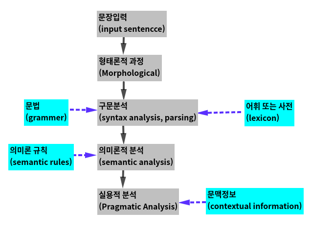
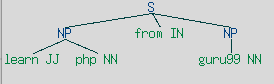
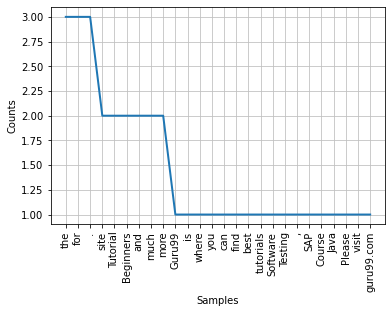

# Components of NLP
[참고](https://www.guru99.com/nlp-tutorial.html)
Five main Component of Natural Language processing in AI are:

- Morphological and Lexical Analysis (형태 및 어휘 분석)    
- Syntactic Analysis (구문 분석)
- Semantic Analysisl (의미 분석)
- Discourse Integration (담론 통합)
- Pragmatic Analysis (실용적인 분석)



### 형태 및 어휘 분석 
어휘 분석은 단어와 표현을 포함하는 어휘입니다. 그것은 단어 구조의 분석, 식별 및 설명을 묘사합니다. 그것은 텍스트를 단락, 단어 및 문장으로 나누는 것을 포함합니다. 

개별 단어를 구성 요소로 분석하고 구두점과 같은 비단어 토큰을 단어에서 분리합니다.

### 의미 분석 
의미 분석은 의미를 할당하는 구문 분석기에 의해 생성된 구조입니다. 이 구성 요소는 단어의 선형 시퀀스를 구조로 전송합니다. 단어가 서로 어떻게 연결되어 있는지 보여줍니다.

의미론은 단어, 구 및 문장의 문자적 의미에만 초점을 맞춥니다. 이것은 주어진 컨텍스트에서 사전 의미 또는 실제 의미를 추상화합니다. 구문 분석기에 의해 할당된 구조에는 항상 의미가 할당되었습니다.

E.g.. “colorless green idea.” This would be rejected by the Symantec analysis as colorless Here; green doesn’t make any sense.

### 실용적인 분석 
실용 분석은 전반적인 의사 소통 및 사회적 내용과 해석에 미치는 영향을 다룹니다. 이는 상황에서 언어의 의미 있는 사용을 추상화하거나 도출하는 것을 의미합니다. 이 분석에서 주된 초점은 항상 무엇을 의미하는지에 대한 재해석에서 말한 것입니다. 

실용적인 분석은 협력 대화를 특징짓는 일련의 규칙을 적용하여 사용자가 의도한 효과를 발견하는 데 도움이 됩니다.

E.g., “close the window?” should be interpreted as a request instead of an order.

### 구문분석 
단어는 일반적으로 구문의 가장 작은 단위로 받아들여집니다. 구문은 개별 언어의 문장 구조를 제어하는 원칙과 규칙을 나타냅니다. 

구문은 그것의 의미에 영향을 줄수 있는 단어의 적절한 순서에 초점을 굽니다. 이것은 문장의 문법적 구조를 따라 문장의 단어를 분석하는 것을 포함합니다. 단어들은 그들이 서로 관련되어 있는 방법을 보여주기 위한 구조 내로 이동됩니다. 

### 담론통합 (Discourse Integration)
맥락의 감각을 의미합니다. 해당 문장에 의존하는 단일 문장의 의미. 또한 다음 문장의 의미를 고려합니다.
For example, the word “that” in the sentence “He wanted that” depends upon the prior discourse context.

## NLP 및 작문 시스템 
언어에 사용되는 쓰기 시스템의 종류는 텍스트 전처리에 대한 최상의 접근 방식을 결정하는 결정 요소 중 하나입니다. 쓰기 시스템은 다음과 같습니다.
1. Logographic: 많은 수의 개별 기호가 단어를 나타냅니다. 
2. 음절: 개별 기호는 음절을 나타냅니다. 
3. 알파벳: 개별 기호는 소리를 나타냅니다. 

대부분의 쓰기 체계는 음절 또는 알파벳 체계를 사용합니다. 로마자에 기초한 비교적 간단한 쓰기 체계를 가진 영어도 아라비아 숫자, 통화 기호(S, £) 및 기타 특수 기호를 포함하는 로고 기호를 사용합니다. 이 포즈는 다음과 같은 도전 과제를 따릅니다. 
- 텍스트에서 의미(의미론)를 추출하는 것은 어려운 일입니다. 
- AI의 NLP는 코퍼스의 품질에 따라 달라집니다. 영역이 방대하면 맥락을 이해하기 어렵습니다. 
- 문자 집합 및 언어에 따라 다릅니다. 

## NLP를 구현하는 방법 
다음은 자연 학습 프로세스에 사용되는 인기 있는 방법입니다. 

**기계 학습**: 기계 학습 중에 사용되는 학습 nlp 절차입니다. 가장 일반적인 경우에 자동으로 초점을 맞춥니다. 따라서 우리가 수동으로 규칙을 작성할 때 사람의 실수에 대해 전혀 정확하지 않은 경우가 많습니다. 

**통계적 추론**: NLP는 통계적 추론 알고리즘을 사용할 수 있습니다. 견고한 모델을 생성하는 데 도움이 됩니다. 예를 들어, 모든 사람에게 알려진 단어나 구조를 포함합니다. 

### NLP 예제

오늘날 자연 프로세스 학습(Natural process learning) 기술은 널리 사용되는 기술입니다. 

다음은 일반적인 자연어 처리 기술입니다. 

**정보 검색 및 웹 검색** 

Google, Yahoo, Bing 및 기타 검색 엔진은 NLP 딥 러닝 모델에 기계 번역 기술을 기반으로 합니다. 알고리즘을 통해 웹페이지의 텍스트를 읽고 의미를 해석하고 다른 언어로 번역할 수 있습니다. 

**문법 수정**

NLP 기술은 맞춤법 교정 및 문법 검사를 위해 MS-word와 같은 워드 프로세서 소프트웨어에서 널리 사용됩니다.

**질문 답변** 

자연어로 질문하려면 키워드를 입력하세요. 

**텍스트 요약** 

소스에서 중요한 정보를 요약하여 축약된 버전으로 만드는 프로세스 

**기계 번역** 

한 자연어에서 다른 자연어로 텍스트나 음성을 번역하기 위해 컴퓨터 응용 프로그램을 사용합니다.

**감정 분석** 
NLP는 기업이 제품에 대한 수많은 리뷰를 분석하는 데 도움이 됩니다. 또한 고객이 특정 제품에 대한 리뷰를 제공할 수 있습니다. 

### NLP의 미래 
- 사람이 읽을 수 있는 자연어 처리는 가장 큰 AI 문제입니다. 그것은 모두 인공지능의 핵심 문제를 해결하고 컴퓨터를 사람만큼 지능적으로 만드는 것과 같습니다. 
- NLP의 도움을 받는 미래의 컴퓨터나 기계는 온라인에서 정보를 배우고 이를 실제 세계에 적용할 수 있지만 이와 관련하여 많은 작업이 필요합니다. 
- 자연어 도구 키트 또는 nltk가 더 효과적입니다. 
- 자연어 생성과 결합하여 컴퓨터는 유용하고 풍부한 정보나 데이터를 수신하고 제공할 수 있게 될 것입니다.

### Natural Language vs. Computer Language
자연어와 콤퓨터 언어의 주요한 차이는 다음과 같습니다. 

|Parameter|	Natural Language|Computer Language|
|:---:|	:---:|	:---:|
|Ambiguous|	They are ambiguous in nature.|They are designed to unambiguous.|
|Redundancy	|Natural languages employ lots of redundancy.|	Formal languages are less redundant.|
|Literalness|	Natural languages are made of idiom & metaphor|	Formal languages mean exactly what they want to say|

## NLP의 장점 
- 사용자는 모든 주제에 대해 질문하고 몇 초 안에 직접적인 답변을 얻을 수 있습니다. 
- NLP 시스템은 자연어로 질문에 대한 답변을 제공합니다. 
- NLP 시스템은 불필요하거나 원치 않는 정보 없이 질문에 대한 정확한 답변을 제공합니다. 
- 질문에 제공된 관련 정보의 양이 많을수록 답변의 정확도가 높아집니다. 
- NLP 프로세스는 컴퓨터가 자신의 언어로 인간과 의사 소통하고 다른 언어 관련 작업을 확장하는 데 도움이 됩니다. 
- 인간에 비해 더 많은 언어 기반 데이터를 피로 없이 편견 없이 일관된 방식으로 수행할 수 있습니다. 
- 고도로 구조화되지 않은 데이터 소스의 구조화  

### NLP의 단점 
- 복잡한 쿼리 언어 - 단어가 잘못되었거나 모호한 질문에 대해 시스템이 올바른 답변을 제공하지 못할 수 있습니다. 
- 이 시스템은 하나의 특정 작업만을 위해 구축되었습니다. 제한된 기능 때문에 새로운 영역과 문제에 적응할 수 없습니다.
- NLP 시스템에는 사용자가 시스템과 추가로 상호 작용할 수 있는 변수(feature) 없는 사용자 인터페이스가 없습니다.

# Tokenization(토큰화)
토큰화는 많은 양의 텍스트를 `token`(토큰)이라고 하는 작은 부분으로 나누는 프로세스입니다. 이러한 토큰은 패턴을 찾는 데 매우 유용하며 형태소 분석 및 표제어를 위한 기본 단계로 간주됩니다. 토큰화는 또한 민감한 데이터 요소를 민감하지 않은 데이터 요소로 대체하는 데 도움이 됩니다. 

자연어 처리는 텍스트 분류, 지능형 챗봇, 감상 분석, 언어 번역 등과 같은 응용 프로그램을 구축하는 데 사용됩니다. 위에서 언급한 목적을 달성하려면 텍스트의 패턴을 이해하는 것이 중요합니다. 

당분간은 형태소 추출과 표제어(stemming and lemmatization)에 대해 걱정하지 말고 사용한 텍스트 데이터 정리 단계로 NLP(자연어 처리)를 다룹니다. 후에 형태소 추출과 표제어에 대해 논의합니다. 텍스트 분류 또는 스팸 필터링과 같은 작업은 Keras 및 Tensorflow와 같은 딥 러닝 라이브러리와 함께 NLP를 사용합니다. Natural Language 툴킷에는 하위 모듈로 구성된 문장을 토큰화하는 매우 중요한 모듈 NLTK가 있습니다. 
1. 단어 토큰화(word tokenize) 
2. 문장 토큰화(sentence tokenize)

## 단어의 토큰화
word_tokenize() 메서드를 사용하여 문장을 단어로 나눕니다. 기계 학습 응용 프로그램에서 더 나은 텍스트 이해를 위해 단어 토큰화의 출력을 DataFrame으로 변환할 수 있습니다. 구두점 제거, 숫자 제거 또는 형태소 분석과 같은 추가 텍스트 정리 단계에 대한 입력으로 제공될 수도 있습니다. 기계 학습 모델은 학습 및 예측을 위해 숫자 데이터가 필요합니다. 단어 토큰화는 텍스트(문자열)에서 숫자 데이터로의 변환의 중요한 부분이 됩니다. [Bag of Words 또는 CountVectorizer](https://en.wikipedia.org/wiki/Bag-of-words_model)를 참조합니다. 이론을 더 잘 이해하려면 아래 단어 토큰화 NLTK 예제를 참조하십시오.


```python
import numpy as np
import pandas as pd
import matplotlib.pyplot as plt
```


```python
import nltk 
from nltk.tokenize import word_tokenize
text='God is Great! I won a lottery.'
wordTok=word_tokenize(text)
print(wordTok)
print(len(wordTok))
```

    ['God', 'is', 'Great', '!', 'I', 'won', 'a', 'lottery', '.']
    9


## 문장의 토큰화 
nltk.tokeenize에서 사용할 수 있는 하위 모듈은 sent_tokenize입니다. 

**단어 토큰화 옵션이 있을 때 문장 토큰화가 필요한 이유는 무엇입니까?** 문장당 평균 단어 수를 계산해야 한다고 상상해 보세요. 어떻게 계산할까요? 이러한 작업을 수행하려면 비율을 계산하기 위해 NLTK 문장 토크나이저와 NLTK 단어 토크나이저가 모두 필요합니다. 이러한 출력은 답이 숫자이기 때문에 머신 트레이닝에 중요한 기능으로 사용됩니다. 문장 토큰화가 단어 토큰화와 어떻게 다른지 알아보려면 아래 NLTK 토크나이저 예제를 확인하세요.


```python
from nltk.tokenize import sent_tokenize
senTok=sent_tokenize(text)
print(senTok)
print(len(senTok))
```

    ['God is Great!', 'I won a lottery.']
    2


## POS(Part Of Speech) Tagging 
POS 태깅은 해당 정의 및 컨텍스트를 기반으로 음성의 특정 부분에 대한 텍스트 형식의 단어를 마크업하는 프로세스입니다. 언어로 된 텍스트 읽기와 각 단어에 특정 토큰(품사)을 할당하는 역할을 합니다. 문법적 태깅이라고도 합니다. NLTK 품사 예를 통해 알아보겠습니다.

|Tag|	Meaning|	|
|:---:|:---:|:---:|
|ADJ|	adjective|	형용사|
|ADP|	adposition|	전치사|
|ADV|	adverb|	부사|
|CONJ|	conjunction	|접속사|
|DET|	determiner, article|	the, a, some, most, every, no, which|
|NOUN|	noun|	명사|
|NUM|	numeral|숫자|
|PRT|	particle|	at, on, out, over per, that, up, wit|
|PRON|	pronoun|	he, their, her, its, my, I, us|
|VERB|	verb|	동사|
|.	|punctuation |marks	. , ; !|
|X	|other|	ersatz, esprit, dunno, gr8, univeristy|


|Abbreviation|Meaning|
|---| :---:|
|CC| coordinating conjunction|
|CD |cardinal digit|
|DT |determiner|
|EX |existential there (like: “there is” … think of it like “there exists”)|
|FW |foreign word|
|IN| preposition/subordinating conjunction|
|JJ |adjective ‘big’|
|JJR| adjective, comparative ‘bigger’|
|JJS| adjective, superlative ‘biggest’|
|LS| list marker 1)|
|MD| modal could, will|
|NN |noun, singular ‘desk’|
|NNS| noun plural ‘desks’|
|NNP| proper noun, singular ‘Harrison’|
|NNPS| proper noun, plural ‘Americans’|
|PDT |predeterminer ‘all the kids’|
|POS| possessive ending parent’s|
|PRP| personal pronoun I, he, she|
|PRP\$| possessive pronoun my, his, hers|
|RB| adverb very, silently,|
|RBR| adverb, comparative better|
|RBS| adverb, superlative best|
|RP| particle give up|
|TO,| to go ‘to’ the store.|
|UH| interjection, errrrrrrrm|
|VB| verb, base form take|
|VBD |verb, past tense, took|
|VBG| verb, gerund/present participle taking|
|VBN| verb, past participle is taken|
|VBP| verb, sing. present, known-3d take|
|VBZ| verb, 3rd person sing. present takes|
|WDT| wh-determiner which|
|WP| wh-pronoun who, what|
|WP\$| possessive wh-pronoun whose|
|WRB| wh-adverb where, when|

## Chunking(덩이짓기)
chunking은 작은 부분의 정보를 가져와서 큰 단위로 그들을 그룹화하는 과정입니다. chunking의 주요 용도는 "명사구" 그룹을 만드는 것입니다. 정규식과 결합된 POS 태깅을 따라 문장에 구조를 추가할 때 사용합니다. 결과 단어 그룹을 ``chunk``(청크)라고 합니다. 얕은 구문 분석(shallow parsing)이라고도 합니다. 

얕은 구문 분석에서는 뿌리와 잎 사이에 최대 한 수준이 있는 반면 깊은 구문 분석은 하나 이상의 수준으로 구성됩니다. 얕은 구문 분석은 가벼운 구문 분석 또는 chunking이라고도 합니다.

### Rules of Chunking

미리 정의된 규칙은 없지만 필요와 요구 사항에 따라 조합할 수 있습니다. 예를 들어 문장에서 명사, 동사(과거 시제), 형용사, 등위 접속사를 태그해야 합니다. 다음과 같이 규칙을 사용할 수 있습니다. 

chunk:{<NN.?>*<VBD.?>*<JJ.?>*<CC>?} 
    
다음 표는 다양한 기호의 의미를 보여줍니다.

    
|Name of symbol|Description|
|:---:|:---:|
|.|Any character except new line|
|*|Match 0 or more repetitions|
|?|Match 0 or 1 repetitions|


```python
from nltk import pos_tag, RegexpParser
text='learn php from guru99 and make study easy'.split()
print("After Split:", text)
```

    After Split: ['learn', 'php', 'from', 'guru99', 'and', 'make', 'study', 'easy']


```python
tokens_tag=pos_tag(text)
print("After tag:", tokens_tag)
```

    After tag: [('learn', 'JJ'), ('php', 'NN'), ('from', 'IN'), ('guru99', 'NN'), ('and', 'CC'), ('make', 'VB'), ('study', 'NN'), ('easy', 'JJ')]


```python
patterns="""mychunk:{<NN.?>*<VBD.?>*<JJ.?>*<CC>?}"""
chunker=RegexpParser(patterns)
print('After Regex:', chunker)
```

    After Regex: chunk.RegexpParser with 1 stages:
    RegexpChunkParser with 1 rules:
           <ChunkRule: '<NN.?>*<VBD.?>*<JJ.?>*<CC>?'>


```python
output=chunker.parse(tokens_tag)
print("After Chunking", output)
```

    After Chunking (S
      (mychunk learn/JJ)
      (mychunk php/NN)
      from/IN
      (mychunk guru99/NN and/CC)
      make/VB
      (mychunk study/NN easy/JJ))


위의 Part of Speech 태그 지정 Python 예제의 결론: "make"는 규칙에 포함되지 않은 동사이므로 mychunk로 태그 지정되지 않습니다.

### Use Case of Chunking
Chunking is used for entity detection. An entity is that part of the sentence by which machine get the value for any intention.

즉, chunking은 토큰의 하위 집합을 선택하는 데 사용됩니다. chunking이 토큰을 선택하는 데 사용되는 방법을 이해하려면 아래 코드를 따르십시오. 이 예에서는 명사구의 덩어리에 해당하는 그래프를 볼 수 있습니다. 코드를 작성하고 더 나은 이해를 위해 그래프를 그립니다.


```python
text="learn php from guru99"
tokens=word_tokenize(text)
print(tokens)
```

    ['learn', 'php', 'from', 'guru99']


```python
tag=pos_tag(tokens)
print(tag)
```

    [('learn', 'JJ'), ('php', 'NN'), ('from', 'IN'), ('guru99', 'NN')]


```python
grammer="NP: {<DT>?<JJ>*<NN>}"
cp=RegexpParser(grammer)
result=cp.parse(tag)
print(result)
```

    (S (NP learn/JJ php/NN) from/IN (NP guru99/NN))


```python
result.draw()  #명사구 chunking에서 볼 수 있는 패턴을 그래픽으로 그립니다.
```



그래프에서 "learn"과 "guru99"는 두 개의 다른 토큰이지만 명사구로 분류되는 반면 토큰 "from"은 명사구에 속하지 않는다는 결론을 내릴 수 있습니다. chunk는 다른 토큰을 동일한 chunk로 분류하는 데 사용됩니다. 결과는 선택한 문법에 따라 달라집니다. 추가 chunk NLTK는 패턴에 태그를 지정하고 텍스트 말뭉치를 탐색하는 데 사용됩니다.

### POS 태그 카운팅
위에서 다양한 pos_tag에 대해 논의했습니다. 이러한 태그를 카운팅하는 방법을 학습합니다. 태그를 세는 것은 텍스트 분류와 자연어 기반 작업을 위한 feature(특징) 준비에 매우 중요합니다. 

**태그를 카운틴하는 방법** 

여기에서 먼저 작업 코드를 작성한 다음 코드를 설명하는 여러 단계를 작성합니다.

태그를 계산하려면 컬렉션 모듈의 Counter 패키지를 사용할 수 있습니다. 카운터는 키-값 연산의 원칙에 따라 작동하는 사전 하위 클래스입니다. 요소가 사전 키로 저장되고 개수가 값인 정렬되지 않은 컬렉션입니다.


```python
from collections import Counter
```


```python
text="Guru99 is one of the best sites to learn WEB, SAP, Ethical Hacking and much more online."
#일부 단어는 대문자, 일부는 소문자이므로 토큰화를 적용하기 전에 모든 단어를 소문자로 변환하는 것이 적절합니다.
lower_case=text.lower()
tokens=word_tokenize(text)
tags=pos_tag(tokens)
print(tags)
```

    [('Guru99', 'NNP'), ('is', 'VBZ'), ('one', 'CD'), ('of', 'IN'), ('the', 'DT'), ('best', 'JJS'), ('sites', 'NNS'), ('to', 'TO'), ('learn', 'VB'), ('WEB', 'NNP'), (',', ','), ('SAP', 'NNP'), (',', ','), ('Ethical', 'NNP'), ('Hacking', 'NNP'), ('and', 'CC'), ('much', 'RB'), ('more', 'JJR'), ('online', 'NN'), ('.', '.')]


```python
counts=Counter(tag for word, tag in tags)
print(counts)
```

    Counter({'NNP': 5, ',': 2, 'VBZ': 1, 'CD': 1, 'IN': 1, 'DT': 1, 'JJS': 1, 'NNS': 1, 'TO': 1, 'VB': 1, 'CC': 1, 'RB': 1, 'JJR': 1, 'NN': 1, '.': 1})


## 빈도 분포 
빈도 분포는 결과가 발생한 횟수를 나타냅니다. 문서에서 각 단어가 나타나는 빈도를 찾는 데 사용됩니다. **FreqDist**class를 사용하고 **nltk.probabilty** 모듈에 의해 정의됩니다. 

빈도 분포는 일반적으로 실험을 반복적으로 실행한 샘플을 세어 생성됩니다. 횟수는 매번 1씩 증가합니다. 예를 들어
```
freq_dist=FreqDist()
```
문서의 토큰을 위해서는 
```
freq_dist.inc(token.type())
```
어떤 단어든 특정 문서에서 몇 번이나 발생했는지 확인할 수 있습니다. 예를 들어 
1. Count 메소드: freq_dist.count('and'), 이 표현식은 'and'가 발생한 횟수의 값을 반환합니다. 카운트 방식이라고 합니다. 
2. Frequency 메소드: freq_dist.freq('and') 이 표현식은 주어진 샘플의 빈도수를 반환합니다. 

우리는 작은 프로그램을 작성하고 그 작동을 자세히 설명할 것입니다. 우리는 일부 텍스트를 작성하고 텍스트에 있는 각 단어의 빈도 분포를 계산할 것입니다.


```python
a = """
Guru99 is the site where you can find the best tutorials for Software Testing Tutorial, SAP Course for Beginners. 
Java Tutorial for Beginners and much more. 
Please    visit the site guru99.com and much more.
"""
words=word_tokenize(a)
print(words)
```

    ['Guru99', 'is', 'the', 'site', 'where', 'you', 'can', 'find', 'the', 'best', 'tutorials', 'for', 'Software', 'Testing', 'Tutorial', ',', 'SAP', 'Course', 'for', 'Beginners', '.', 'Java', 'Tutorial', 'for', 'Beginners', 'and', 'much', 'more', '.', 'Please', 'visit', 'the', 'site', 'guru99.com', 'and', 'much', 'more', '.']


```python
fd=nltk.FreqDist(words)
print(dict(fd))
```

    {'Guru99': 1, 'is': 1, 'the': 3, 'site': 2, 'where': 1, 'you': 1, 'can': 1, 'find': 1, 'best': 1, 'tutorials': 1, 'for': 3, 'Software': 1, 'Testing': 1, 'Tutorial': 2, ',': 1, 'SAP': 1, 'Course': 1, 'Beginners': 2, '.': 3, 'Java': 1, 'and': 2, 'much': 2, 'more': 2, 'Please': 1, 'visit': 1, 'guru99.com': 1}


```python
fd.plot()
plt.show()
```


    

    


위의 그래프는 텍스트에서 각 단어의 출현 횟수를 세는 것에 해당합니다. 텍스트 연구와 텍스트 기반 감성 분석을 구현하는 데 도움이 됩니다. 간단히 말해서, nltk에는 자연어 특징들(features)의 통계를 준비하는 데 도움이 되는 텍스트에서 각 단어의 발생을 계산하는 모듈을 포함합니다. 텍스트에서 키워드를 찾는 데 중요한 역할을 합니다. Extract, PyPDF2와 같은 라이브러리를 사용하여 pdf에서 텍스트를 추출하고 nlk.FreqDist에 텍스트를 공급할 수도 있습니다. 

핵심 용어는 "토큰화"입니다. 토큰화 후 해당 단락 또는 텍스트 문서의 각 단어를 확인하여 해당 단어가 발생한 횟수를 확인합니다. 이를 위해 NLTK 툴킷이 필요하지 않습니다. 자신의 파이썬 프로그래밍 기술로 할 수도 있습니다. NLTK 툴킷은 다양한 작업을 위해 바로 사용할 수 있는 코드만 제공합니다. 

각 단어를 세는 것은 그다지 유용하지 않을 수 있습니다. 대신 한 쌍으로 많은 단어를 다루는 collocation과 bigram에 중점을 두어야 합니다. 이러한 쌍은 기계에 공급할 수 있는 더 나은 자연어 feature에 유용한 키워드를 식별합니다. 자세한 내용은 아래를 참조하세요.

## Collocations: Bigrams and Trigrams
### What is Collocations?

연어(collocation)는 문서에서 여러 번 함께 나타나는 단어 쌍입니다. 문서의 전체 단어 수에 함께 발생하는 쌍의 수로 계산됩니다. 

자외선, 적외선과 같은 단어로 전자기 스펙트럼을 고려하십시오. 

자외선과 광선이라는 단어는 개별적으로 사용되지 않으므로 배열로 취급될 수 있습니다. 또 다른 예는 "CT scan"입니다. CT 와 Scan 을 따로따로 말하는게 아니라 배열로 취급하기도 합니다. 연어를 찾으려면 단어의 빈도와 다른 단어의 문맥에서의 모양을 계산해야 한다고 말할 수 있습니다. 이러한 특정 단어 모음은 유용한 콘텐츠 용어를 유지하기 위해 필터링이 필요합니다. 단어의 각 그램은 연관 척도에 따라 점수를 매겨 각 Ingram이 연어일 가능성을 결정할 수 있습니다. 

Collocation은 두 가지 유형으로 분류할 수 있습니다.
- Bigrams combination of two words
- Trigrams combinationof three words

Bigrams와 Trigrams는 특징 추출단계에서 보다 의미있고 유용한 기능을 제공합니다. 이는 텍스트 기반 감상 분석에 특히 유용합니다. 


```python
# bigrams의 예
text="Guru99 is a totally new kind of learning experience."
tokens=word_tokenize(text)
output=list(nltk.bigrams(tokens))
print(output)
```

    [('Guru99', 'is'), ('is', 'a'), ('a', 'totally'), ('totally', 'new'), ('new', 'kind'), ('kind', 'of'), ('of', 'learning'), ('learning', 'experience'), ('experience', '.')]


때로는 통계 분석 및 빈도 수를 계산하기 위해 문장에서 세 단어 쌍을 보는 것이 중요해집니다. 이것은 다시 NLP(자연어 처리 특징들)와 텍스트 기반 감상 예측을 형성하는 데 중요한 역할을 합니다. 트라이그램을 계산하기 위해 동일한 코드가 실행됩니다.


```python
# trigrams의 예 
output2=list(nltk.trigrams(tokens))
print(output2)
```

    [('Guru99', 'is', 'a'), ('is', 'a', 'totally'), ('a', 'totally', 'new'), ('totally', 'new', 'kind'), ('new', 'kind', 'of'), ('kind', 'of', 'learning'), ('of', 'learning', 'experience'), ('learning', 'experience', '.')]


### Taggging sentences
더 넓은 의미의 태깅은 문장의 문맥에 따라 동사, 명사 등의 레이블을 추가하는 것을 의미합니다. POS 태그 식별은 복잡한 과정입니다. 따라서 일부 단어는 문장의 구조에 따라 다른(모호한) 의미를 가질 수 있으므로 POS의 일반 태깅은 수동으로 불가능합니다. 목록 형식의 텍스트 변환은 목록의 각 단어가 반복되고 특정 태그에 대해 계산되기 때문에 태그를 지정하기 전에 중요한 단계입니다. 더 잘 이해하려면 아래 코드를 참조하십시오


```python
text="Hello Guru99, You have to build a very good site, and I love visiting your site."
sentence=sent_tokenize(text)
for sent in sentence:
    print(pos_tag(word_tokenize(sent)))
```

    [('Hello', 'NNP'), ('Guru99', 'NNP'), (',', ','), ('You', 'PRP'), ('have', 'VBP'), ('to', 'TO'), ('build', 'VB'), ('a', 'DT'), ('very', 'RB'), ('good', 'JJ'), ('site', 'NN'), (',', ','), ('and', 'CC'), ('I', 'PRP'), ('love', 'VBP'), ('visiting', 'VBG'), ('your', 'PRP$'), ('site', 'NN'), ('.', '.')]


**In Corpus there are two types of POS taggers:**

- Rule-Based
- Stochastic POS Taggers

1. **규칙 기반 POS 태거**: 의미가 모호한 단어에 대해 문맥 정보를 기반으로 하는 규칙 기반 접근 방식을 적용합니다. 선행 또는 다음 단어의 의미를 확인하거나 분석하여 수행합니다. 정보는 단어의 주변이나 단어 자체 내에서 분석됩니다. 따라서 단어에는 대문자 및 구두점과 같은 특정 언어의 문법 규칙에 따라 태그가 지정됩니다. 예: Brill의 태거. 
2. **확률적 POS 태거**: 빈도 또는 확률과 같은 다양한 접근 방식이 이 방법에 적용됩니다. 단어가 훈련 세트의 특정 태그로 대부분 태그가 지정된 경우 테스트 문장에서 해당 특정 태그가 지정됩니다. 태그라는 단어는 자신의 태그뿐만 아니라 이전 태그에도 의존합니다. 이 방법이 항상 정확한 것은 아닙니다. 또 다른 방법은 문장에서 특정 태그가 발생할 확률을 계산하는 것입니다. 따라서 최종 태그는 특정 태그가 있는 단어의 가장 높은 확률을 확인하여 계산됩니다.

### 은닉 마르코프 모델을 사용한 POS 태깅 
태깅 문제는 HMM(Hidden Markov Model)을 사용하여 모델링할 수도 있습니다. 태그는 숨겨진 상태로 간주되고 목표는 숨겨진 상태 시퀀스를 결정하는 동안 입력 토큰을 관찰 가능한 시퀀스로 취급합니다. 예를 들어 $x = x_1,x_2,\cdots,x_n$ 여기서 x는 토큰 시퀀스이고 $y = y_1,y_2,y_3,y_4, \cdots, y_n$는 숨겨진 시퀀스입니다. 

**HMM(Hidden Markov Model)은 어떻게 작동합니까?** 

HMM은 P(x, y)인 결합 분포(join distribution)를 사용합니다. 여기서 x는 입력 시퀀스/토큰 시퀀스이고 y는 태그 시퀀스입니다. x에 대한 태그 시퀀스는 $\underset{y_1, \cdots, y_n}{argmax} p(x_1,x_2,\cdots, x_n,y_1,y_2,y3_,\cdots y_n)$입니다. 텍스트에서 태그를 분류했지만 이러한 태그의 통계는 매우 중요합니다. 그래서 다음 부분은 통계 연구를 위해 이러한 태그를 계산하는 것입니다.

## Python NLTK에서 stemming(어간추출) 과 lemmatization(표제어 추출)

표제어(Lemma)는 한글로는 '표제어' 또는 '기본 사전형 단어' 정도의 의미를 갖습니다. 표제어 추출은 단어들로부터 표제어를 찾아가는 과정입니다.

Python NLTK의 어간추출 및 표제어는 자연어 처리를 위한 텍스트 정규화 기술입니다. 이러한 기술은 텍스트 전처리에 널리 사용됩니다. 어간추출과 표제어 추출의 차이점은 어간추출은 문맥을 모른 채 단어를 자르므로 더 빠르고, 표제어 추출은 처리하기 전에 단어의 문맥을 알기 때문에 느리다는 것입니다. 
이 Stemming & Lemmatization 튜토리얼에서는 다음을 배우게 됩니다.

### 어간추출
자연어 처리에서 단어를 정규화하는 방법입니다. 문장의 단어 집합의 검색을 단축하기 위해 시퀀스로 변환하는 기술입니다. 이 방법은 의미는 같지만 문맥이나 문장에 따라 약간의 변형이 있는 단어를 정규화합니다. 

즉, 하나의 어근이 있지만 같은 단어의 변형이 많습니다. 예를 들어, 어근은 "eat"이고 변형은 "eats, eating, eaten, and like so"입니다. 같은 방식으로 Python의 형태소 분석의 도움으로 모든 변형의 루트 단어를 찾을 수 있습니다.

```
He was riding.
He was taking the ride.
```
위의 두 문장에서 의미는 동일합니다. 즉, 과거의 승마 활동입니다. 인간은 두 가지 의미가 동일하다는 것을 쉽게 이해할 수 있습니다. 그러나 기계의 경우 두 문장이 다릅니다. 따라서 동일한 데이터 행으로 변환하기가 어려워졌습니다. 동일한 데이터 세트를 제공하지 않으면 기계가 예측하지 못합니다. 따라서 머신러닝을 위한 데이터셋을 준비하기 위해서는 각 단어의 의미를 구별할 필요가 있습니다. 여기에서 형태소 분석은 루트 단어를 가져와 동일한 유형의 데이터를 분류하는 데 사용됩니다. 이것을 파이썬 프로그램으로 구현해 봅시다. NLTK에는 ``PorterStemmer``라는 알고리즘이 있습니다. 이 알고리즘은 토큰화된 단어 목록을 수락하고 이를 루트 단어로 분리합니다.


```python
from nltk.stem import PorterStemmer
e_words=['wait','waiting', 'waited', 'waits']
ps=PorterStemmer()
for w in e_words:
    rootWord=ps.stem(w)
    print(rootWord)
```

    wait
    wait
    wait
    wait


위의 결과에서 파생된 어간추출은 데이터의 중복성과 동일한 단어의 변형을 제거했기 때문에 중요한 전처리 단계로 간주됩니다. 결과적으로 데이터가 필터링되어 더 나은 기계 학습에 도움이 됩니다. 이제 완전한 문장을 전달하고 그 동작을 출력으로 확인합니다.


```python
sentence="Hello Guru99, You have to build a very good site and I love visiting your site."
words=word_tokenize(sentence)
ps=PorterStemmer()
for w in words:
    rootWord=ps.stem(w)
    print(rootWord)
```

    hello
    guru99
    ,
    you
    have
    to
    build
    a
    veri
    good
    site
    and
    i
    love
    visit
    your
    site
    .


어간추출은 데이터 전처리 모듈입니다. 영어에는 한 단어의 다양한 변형이 있습니다. 이러한 변형은 기계 학습 훈련 및 예측에서 모호성을 만듭니다. 성공적인 모델을 만들려면 이러한 단어를 필터링하고 어간추출을 사용하여 동일한 유형의 시퀀스 데이터로 변환하는 것이 중요합니다. 또한 이것은 문장 집합에서 행 데이터를 가져오고 <mark>정규화라고도하는 중복 데이터를 제거</mark>하는 중요한 기술입니다.

## 표제어 추출

https://www.guru99.com/stemming-lemmatization-python-nltk.html

NLTK의 표제어(사전에 등록된 단어) 추출은 의미와 문맥에 따라 단어의 표제어를 찾는 알고리즘 프로세스입니다. 표제어는 일반적으로 어미를 제거하는 것을 목표로 하는 단어의 형태학적 분석을 나타냅니다. 즉, 단어의 기본 또는 사전 형식을 반환하는 데 도움이 됩니다. 

NLTK Lemmatization 방법은 WorldNet의 내장 morph 함수를 기반으로 합니다. 텍스트 전처리에는 형태소 분석과 표제어 추출이 모두 포함됩니다. 많은 사람들이 두 용어를 혼동합니다. 일부는 이것을 동일하게 취급하지만 형태소 분석과 표제어 추출에는 차이가 있습니다. 다음과 같은 이유로 Lemmatization이 전자보다 선호됩니다.

어간 추출 알고리즘은 단어에서 접미사를 절단하여 작동합니다. 넓은 의미에서 단어의 시작이나 끝을 잘라냅니다. 이에 반해 표제어는 보다 강력한 연산으로 단어의 형태소 분석(morphological analysis)을 고려합니다. 모든 inflection form(굴절 형태)의 기본 형태인 표제어를 반환합니다. 표제어에 대한 사전을 만들고 단어의 적절한 형태를 찾기 위해서는 심도 있는 언어 지식이 필요합니다. 형태소 분석은 일반적인 작업인 반면, 표제어 추출은 사전에서 적절한 형식을 찾는 지능적인 작업입니다. 따라서 표제어는 더 나은 기계 학습 기능을 형성하는 데 도움이 됩니다.

>> 굴절(inflection form): 어간의 변화된 형태를 의미 예를 들어 명사와 형용사는 '토씨 즉, 격조사'가 붙은 것, 동사의 경우는 인칭과 수에 적합하도록 활용된 형태를 의미합니다. 


```python
#어간 추출
ps=PorterStemmer()
text="studies studying cries cry"
tokens=word_tokenize(text)
tokens
```


    ['studies', 'studying', 'cries', 'cry']


```python
for w in tokens:
    print(f"stemming for {w} is {ps.stem(w)}")
```

    stemming for studies is studi
    stemming for studying is studi
    stemming for cries is cri
    stemming for cry is cri


```python
#표제어 추출 
from nltk.stem import WordNetLemmatizer
wLemma=WordNetLemmatizer()
for w in tokens:
    print(f"Lemma of {w} is {wLemma.lemmatize(w)}")
```

    Lemma of studies is study
    Lemma of studying is studying
    Lemma of cries is cry
    Lemma of cry is cry


Lemmatizer는 텍스트 모호성을 최소화합니다. Bicycle 또는 Bicycles과 같은 예시 단어는 기본 단어 Bicycle로 변환됩니다. 기본적으로 의미는 같지만 표현이 다른 모든 단어를 기본 형식으로 변환합니다. 주어진 텍스트의 단어 밀도를 줄이고 훈련 기계에 대한 정확한 기능을 준비하는 데 도움이 됩니다. 데이터가 깨끗할수록 기계 학습 모델이 더 지능적이고 정확해집니다. NLTK Lemmatizer는 메모리와 계산 비용도 절약합니다.


```python
from nltk.corpus import wordnet as wn
from collections import defaultdict
tagMap=defaultdict(lambda: wn.NOUN)
list(tagMap)
```


    []


```python
tagMap['J']=wn.ADJ
tagMap['V']=wn.VERB
tagMap['R']=wn.ADV
tagMap
```


    defaultdict(<function __main__.<lambda>()>, {'J': 'a', 'V': 'v', 'R': 'r'})


```python
text = "guru99 is a totally new kind of learning experience."
tokens = word_tokenize(text)
lemFun= WordNetLemmatizer()
for token, tag in pos_tag(tokens):
    lemma = lemFun.lemmatize(token, tagMap[tag[0]])
    print(token, "=>", lemma)
```

    guru99 => guru99
    is => be
    a => a
    totally => totally
    new => new
    kind => kind
    of => of
    learning => learn
    experience => experience
    . => .


위 과정에서 pos_tag(tokens)는 각 토큰과 대응하는 품사를 반환합니다. 명사의 경우 NN과 같이 나타내며 이를 이전에 작성한 tagMap에 적합시키기 위해서는 N만이 필요합니다. 그러므로 tag[0] 인자를 전달합니다. 표제어 추출을 위한 함수 WordNetLemmatizer.lemmatizer()를 적용합니다. 즉, 각 토큰과 그 토큰의 품에 대해 표제어를 반환합니다. 

## NLTK WordNet: Python에서 NLTK WordNet의 동의어 찾기

Wordnet은 영어 어휘 데이터베이스인 NLTK corpus reader입니다. 단어, 동의어 또는 반의어의 의미를 찾는 데 사용할 수 있습니다. 의미 지향적인 영어 사전으로 정의할 수 있습니다. 다음 명령으로 가져옵니다.

```
from nltk.corpus import wordnet as wd
```

통계에 따르면 영어 WordNet에는 155287개의 단어와 117659개의 동의어 집합이 포함되어 있습니다. WordNet에서 사용할 수 있는 다른 방법은 dir(guru)을 입력하여 찾을 수 있습니다.

다음 함수 synsets()은 유의어(synonym) 집합 또는 유의어 모음을 반환합니다. 

<table border="1", cellpadding="20">
    <tbody>
        <tr>
            <th>관계</th><th>의미</th><th>명칭</th><th>예</th>
        </tr>
        <tr>
            <td>유의관계</td><td>말소리가 다르지만 의미가 비슷</td><td>유(동)의어</td><td>유의관계를 보이는 단어들 <br/>참다-견디다, 기쁨-환희, 기르다-키우다</td>
       </tr>
        <tr><td>반의관계</td><td>단어의 이미가 짝을 이루어 대립</td><td>반의어</td><td>반의관계를 보이는 단어들 <br/>길다-짧다, 쉽다-어렵다, 남성-여성, 참-거짓</td></tr>
        <tr><td rowspan="2">상하관계</td><td rowspan="2">단어가 다른 단어를 포함하거나 포함됨</td><td>상의어</td><td>포함하는 단어 <br/>동물 </td></tr>
         <tr><td>하의어</td><td>포함되는 단어 <br/>강아지, 고양이</td></tr>
        <tr><td rowspan="2">복합관계</td><td rowspan="2"></td><td>다의어</td><td>두가지 이상의 뜻을 가진 단어 <br/>헥심적 의미, 주변적 의미 </td></tr>
        <tr><td>동음이의어</td><td>소리는 같으나 뜻이 다른 단어</td></tr>
    </tbody>
    </table>
    


```python
from nltk.corpus import wordnet as wd
```


```python
print(dir(wd))
```

    ['ADJ', 'ADJ_SAT', 'ADV', 'MORPHOLOGICAL_SUBSTITUTIONS', 'NOUN', 'VERB', '_ENCODING', '_FILEMAP', '_FILES', '__class__', '__delattr__', '__dict__', '__dir__', '__doc__', '__eq__', '__format__', '__ge__', '__getattribute__', '__gt__', '__hash__', '__init__', '__init_subclass__', '__le__', '__lt__', '__module__', '__ne__', '__new__', '__reduce__', '__reduce_ex__', '__repr__', '__setattr__', '__sizeof__', '__str__', '__subclasshook__', '__weakref__', '_compute_max_depth', '_data_file', '_data_file_map', '_encoding', '_exception_map', '_fileids', '_get_root', '_key_count_file', '_key_synset_file', '_lang_data', '_lemma_pos_offset_map', '_lexnames', '_load_exception_map', '_load_lang_data', '_load_lemma_pos_offset_map', '_max_depth', '_morphy', '_omw_reader', '_pos_names', '_pos_numbers', '_root', '_synset_from_pos_and_line', '_synset_from_pos_and_offset', '_synset_offset_cache', '_tagset', '_unload', 'abspath', 'abspaths', 'all_lemma_names', 'all_synsets', 'citation', 'custom_lemmas', 'encoding', 'ensure_loaded', 'fileids', 'get_version', 'ic', 'jcn_similarity', 'langs', 'lch_similarity', 'lemma', 'lemma_count', 'lemma_from_key', 'lemmas', 'license', 'lin_similarity', 'morphy', 'of2ss', 'open', 'path_similarity', 'readme', 'res_similarity', 'root', 'ss2of', 'synset', 'synset_from_pos_and_offset', 'synset_from_sense_key', 'synsets', 'words', 'wup_similarity']


```python
pos_tag(['dog'])
```


    [('dog', 'NN')]


```python
syns=wd.synsets("dog")
print(syns)
```

    [Synset('dog.n.01'), Synset('frump.n.01'), Synset('dog.n.03'), Synset('cad.n.01'), Synset('frank.n.02'), Synset('pawl.n.01'), Synset('andiron.n.01'), Synset('chase.v.01')]


이들은 반복하는 의미론적 관계입니다. {x1,x2,…xn}과 {y1,y2,…yn} 사이에 관계가 있으면 {y1,y2,…yn}과 {x1,x2,…xn} 사이에도 관계가 있습니다. 예를 들어 ``동의어(Synonym)``는 ``반의어(antonym)``의 반대이고, ``상의어(hypernym)``와 ``하의어(hyponym)``는 어휘 개념의 한 유형입니다. Wordnet을 사용하여 "active"라는 단어의 동의어와 반의어를 찾는 프로그램을 파이썬으로 작성해 보겠습니다.


```python
synonyms=[]
antonyms=[]
for syn in wn.synsets('active'):
    for i in syn.lemmas():
        synonyms.append(i.name())
        if i.antonyms():
            antonyms.append(i.antonyms()[0].name())
            
print(set(synonyms))
print(set(antonyms))
```

    {'combat-ready', 'active', 'active_agent', 'active_voice', 'fighting', 'alive', 'participating', 'dynamic'}
    {'passive', 'extinct', 'dormant', 'quiet', 'passive_voice', 'stative', 'inactive'}


WordNet은 주요 검색 엔진에서 사용되는 어휘 데이터베이스입니다. WordNet에서 주어진 단어나 구에 대한 정보는 다음과 같이 계산할 수 있습니다. 
- 동의어 (동일한 의미를 가진 단어) 
- 상의어 (hypernyms, 특정 부류를 지정하는 데 사용되는 일반적인 용어(예: 식사는 아침 식사), 하위 동의어(hyponyms, 쌀은 식사) 
- holonyms(전체의 부분인 단어를 의미합니다.) 
- meronyms (구성요소의 일부 또는 구성원을 나타냅니다. 식사는 일일 음식 섭취의 일부) 

WordNet은 또한 좌표 용어, 파생어, 감각 등에 대한 정보를 제공합니다. 두 단어 사이의 유사점을 찾는 데 사용됩니다. 또한 관련 단어의 결과에 대한 정보도 보유합니다. 간단히 말해서 사전이나 유의어 사전으로 취급할 수 있습니다. 워드넷으로 더 깊이 들어가면 다음과 같이 총 4개의 서브넷으로 나뉩니다. 
- 명사 
- 동사 
- 형용사 
- 부사 
               
텍스트 분석을 위한 인공 지능 분야에서 사용할 수 있습니다. Wordnet의 도움으로 맞춤법 검사, 언어 번역, 스팸 탐지 등을 위한 말뭉치를 만들 수 있습니다. 같은 방식으로 이 말뭉치를 사용하고 일부 동적 기능을 작동하도록 성형할 수 있습니다. 이것은 당신을 위해 코퍼스를 만들 준비가 된 것과 같습니다. 마음대로 사용하시면 됩니다.
