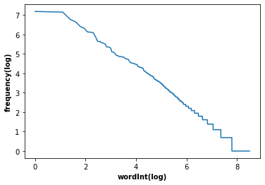
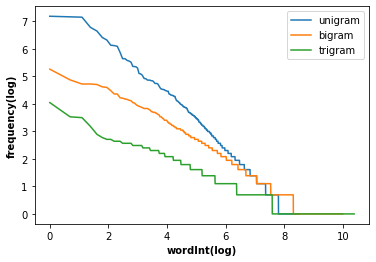

```python
%matplotlib inline
import numpy as np
import pandas as pd
import matplotlib.pyplot as plt
import torch
from torch.utils.data import TensorDataset
from torch.utils.data import DataLoader
import torch.nn as nn
from torch import optim
import torch.nn.functional as F
```


```python
import re
```

소설 'Time machine'을 호출하고 문자가 아닌 부분을 공백으로 치환합니다. 또한 모두 소문자로 변환합니다. 반환되는 결과는 리스트형입니다. 
______________


```python
def read_time_machine(): #@save
    """Load the time machine dataset into a list of text lines."""
    with open('./timeMachine.txt', 'r') as f:
        lines = f.readlines()
    return [re.sub('[^A-Za-z]+', ' ', line).strip().lower() for line in lines]
lines = read_time_machine()
print(f'# text lines: {len(lines)}')
print(lines[0])
print(lines[10])
```

    # text lines: 3557
    the project gutenberg ebook of the time machine by h g wells
    title the time machine


```python
import nltk
from nltk.tokenize import word_tokenize, sent_tokenize
from nltk.corpus import stopwords
```

호출한 책의 한 줄을 한 행이 되므로 각 행에 대한 말뭉치의 토큰화를 실시합니다. 
________________________________


```python
totalToken=[]
for line in lines:
    totalToken +=word_tokenize(line)
len(totalToken)
```


    36041


```python
print(totalToken[:10])
```

    ['the', 'project', 'gutenberg', 'ebook', 'of', 'the', 'time', 'machine', 'by', 'h']


토큰들의 빈도수는 ``nltk.FreqDist()`` 함수를 사용합니다. 이 결과를 내림차순으로 정렬합니다. 사전형의 정렬은 ``sorted()`` 함수를 적용합니다. 


```python
fdSingle=nltk.FreqDist(totalToken)
fdSingle
```


    FreqDist({'the': 2477, 'and': 1312, 'of': 1286, 'i': 1268, 'a': 877, 'to': 766, 'in': 606, 'was': 554, 'that': 458, 'it': 452, ...})


```python
fdSingleSort=sorted(fdSingle.items(), key=lambda fdSingle:fdSingle[1], reverse=True)
print(fdSingleSort[:10])
```

    [('the', 2477), ('and', 1312), ('of', 1286), ('i', 1268), ('a', 877), ('to', 766), ('in', 606), ('was', 554), ('that', 458), ('it', 452)]


단어의 빈도는 빠르게 쇠퇴한다는 것은 아주 분명합니다. 10번째로 많이 사용되는 단어는 가장 많이 사용되는 단어의 1/5 미만입니다. 


```python
fre=[i[1] for i in fdSingleSort]
plt.plot(np.log(range(len(fre))), np.log(fre))
plt.xlabel("wordInt(log)", weight='bold')
plt.ylabel('frequency(log)', weight='bold')
plt.show()
```

    <ipython-input-9-f1ad53d13c49>:2: RuntimeWarning: divide by zero encountered in log
      plt.plot(np.log(range(len(fre))), np.log(fre))


    

    


여기서 우리는 아주 근본적인 것에 대해 이야기하고 있습니다. 위의 결과와 같이 단어의 빈도는 빠르게 감소합니다. 처음 몇 단어를 예외로 처리한 후 나머지 모든 단어는 로그 로그 플롯에서 대략 직선을 따릅니다. 이것은 단어가 i번째 가장 빈번한 단어의 빈도 $n_i$가 다음과 같다는 Zipf의 법칙을 충족한다는 것을 의미합니다.

$$\begin{align}n_i & \propto \frac{1}{i^\alpha}\\ \log n_i & = -\alpha \log i + c \end{align}$$

여기서 α는 분포를 특성화하는 지수이고 c는 상수입니다. bigram, trigram 등과 같은 다른 단어 조합의 분포를 알아봅니다. 이 단어조합은 위에서 작성한 객체 totalToken의 성분을 순서대로 2개와 3개씩으로 그룹화한 것입니다. 


```python
bigramToken=nltk.bigrams(totalToken)
freBi=nltk.FreqDist(bigramToken)
list(freBi.items())[:3]
```


    [(('the', 'project'), 33),
     (('project', 'gutenberg'), 88),
     (('gutenberg', 'ebook'), 3)]


```python
trigramToken=nltk.trigrams(totalToken)
freTri=nltk.FreqDist(trigramToken)
list(freTri.items())[:3]
```


    [(('the', 'project', 'gutenberg'), 33),
     (('project', 'gutenberg', 'ebook'), 3),
     (('gutenberg', 'ebook', 'of'), 1)]


```python
fd2Sort=sorted(freBi.items(), key=lambda freBi:freBi[1], reverse=True)
fd3Sort=sorted(freTri.items(), key=lambda freTri:freTri[1], reverse=True)
```


```python
fre=[i[1] for i in fdSingleSort]
fre2=[i[1] for i in fd2Sort]
fre3=[i[1] for i in fd3Sort]
plt.plot(np.log(range(len(fre))), np.log(fre), label="unigram")
plt.plot(np.log(range(len(fre2))), np.log(fre2), label="bigram")
plt.plot(np.log(range(len(fre3))), np.log(fre3), label="trigram")
plt.xlabel("wordInt(log)", weight='bold')
plt.ylabel('frequency(log)', weight='bold')
plt.legend(loc="best")
plt.show()
```

    <ipython-input-13-b81d4900feb6>:4: RuntimeWarning: divide by zero encountered in log
      plt.plot(np.log(range(len(fre))), np.log(fre), label="unigram")
    <ipython-input-13-b81d4900feb6>:5: RuntimeWarning: divide by zero encountered in log
      plt.plot(np.log(range(len(fre2))), np.log(fre2), label="bigram")
    <ipython-input-13-b81d4900feb6>:6: RuntimeWarning: divide by zero encountered in log
      plt.plot(np.log(range(len(fre3))), np.log(fre3), label="trigram")


    

    


이 수치는 여러 가지 이유로 매우 흥미롭습니다. 첫째, 유니그램 단어 외에도 단어 시퀀스도 Zipf의 법칙을 따르는 것처럼 보이지만 시퀀스 길이가 감소할 수 록 기울기가 감소되는 것으로 $\alpha$가 감소합니다. 둘째, 고유한 n-gram의 수가 그렇게 많지 않습니다. 이것은 우리에게 언어에 많은 구조가 있다는 희망을 줍니다. 셋째, 많은 n-gram이 매우 드물게 발생하므로 Laplace Smoothing이 언어 모델링에 적합하지 않습니다. 대신 딥 러닝 기반 모델을 사용합니다.
