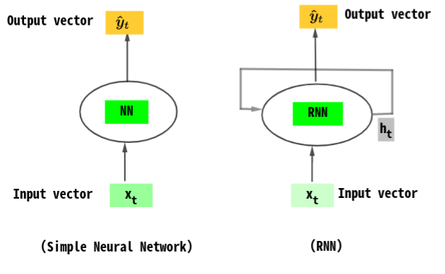
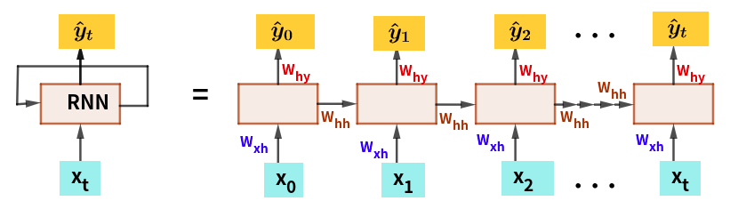
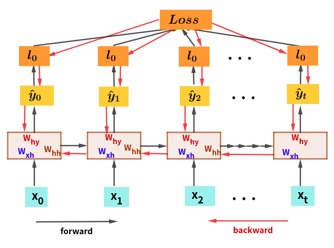
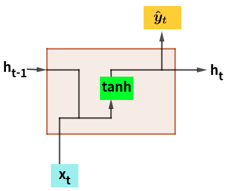
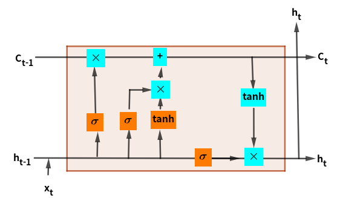
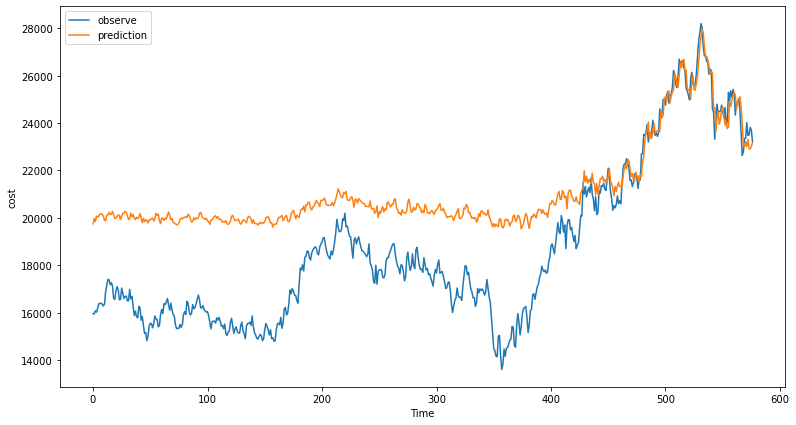
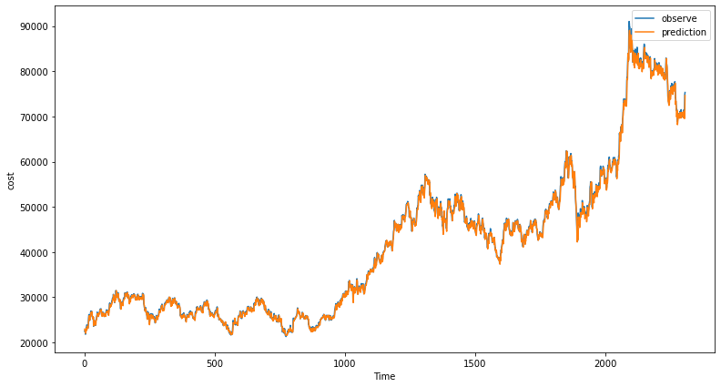

```python
import FinanceDataReader as fdr
import numpy as np
import pandas as pd
import itertools
import matplotlib.pyplot as plt
import torch
import torch.nn as nn
import torch.nn.functional as F
import torch.optim as optim
from torch.utils.data import TensorDataset, DataLoader
```

## Sequential Data
시퀀스 데이터(순차 데이터)는 데이터가 나열되어 있는 순서에 중요한 의미가 부여됩니다. 몇 가지 일반적인 유형의 순차 데이터를 예제와 함께 살펴보겠습니다.
1. Language data/a sentence  
예를 들어 “My name is Ahmad”의 문장을 “Name is my Ahmad”와 같이 단어의 순서를 바꾼다면 성립하지 않습니다. 즉, 단어들의 순서가 문장의 의미를 전달하는 데 중요한 요소이기 때문에 순차 데이터입니다. 
2. Time Series Data
예를 들어, 회사 A의 연간 주식 시장 가격과 같은 종류의 데이터는 연도별로 확인하고 순서와 추세를 찾아야 합니다. 연도의 순서는 변경할 수 없습니다.
3. Biological Data 
예를 들어, DNA 서열은 순서대로 유지되어야 합니다. 

관찰하면 순차 데이터는 우리 주변 어디에나 있습니다. 예를 들어 오디오를 음파, 텍스트 데이터 등의 시퀀스로 볼 수 있습니다. 이것들은 순서를 유지해야 하는 순차 데이터의 몇 가지 일반적인 예입니다. 

 Experiments over time have proven that traditional neural networks, such as dense neural networks, are not good for these tasks and are unable to preserve the sequence. Thus,  you’ll need some kind of architecture that can preserve the sequence of the data. 
 
다음 섹션에서는 기존 신경망 아키텍처의 한계와 LSTM에 대한 이해를 기반으로 하는 순환 신경망의 몇 가지 문제에 대해 설명합니다.

## LSTM
LSTM의 개념과 중요성을 이해하려면 LSTM이 필요한 이유를 이해해야 합니다. 순차 데이터를 처리하는 데 적합한 또 다른 아키텍처가 필요하다고 느끼게 한 다른 신경망 아키텍처의 한계는 무엇입니까? 이를 위해서는 LSTM이 RNN의 수정된 아키텍처이기 때문에 RNN(Recurrent Neural Networks)의 작동 및 단점도 이해해야 합니다. 

### 전통적 신경망의 한계

다음의 단순한 신경망을 생각해 봅니다. 


이 이미지는 X가 입력이고 ŷ이 수학적 계산을 통해 생성된 출력인 간단한 신경망의 작동을 보여줍니다. 이것은 간단한 일대일 신경망입니다. 유사하게 아래 이미지와 같이 다대다 신경망 또는 조밀하게 연결된 신경망을 가질 수 있습니다.


이러한 네트워크는 기존 기계 학습 알고리즘보다 성능이 우수하지만 몇 가지 단점이 있습니다. 그 중 하나는 물론 순차 데이터입니다. 기존 신경망의 다른 단점은 다음과 같습니다. 
1. 고정된 입력 길이를 가집니다. 
    - 입력 길이가 고정되어 신경망이 동일한 길이의 입력을 받아야 한다는 것을 의미합니다. 
    - 한 국가의 연간 GDP와 같은 일반적인 순차적 데이터 세트의 경우 동일한 수의 특성(feature)을 갖기 때문에 이 문제는 큰 문제가 아닙니다. 그러나 이 문제는 각 문장의 길이가 다른 언어와 같은 데이터를 다룰 때 발생합니다. 
    - 예를 들어 ["Hello", "How", "are", "you]는 길이가 4이고 ["My", "Name", "is", "Ahmad", "and", "I", "am", "sleeping"]은 9개의 단어로 구성된 벡터입니다. 이것은 매우 제한적인 심각한 문제입니다. 이러한 문제는 전통적 신경망 모델에서 잘 수행되지 않습니다. 
2. 데이터의 순서를 기억할 수 없습니다. 즉, 순서는 중요하지 않습니다. 
    - 데이터의 순서를 기억할 수 없거나 순서가 중요하지 않다는 것입니다. 
    - 예를 들어 이 문제를 이해합시다. "I am Ahmad, not Hassan"이라는 문장과 "I am Hassan, not Ahmad"라는 문장이 있다고 가정해 보겠습니다. 
    - 두 문장 모두 동일한 단어를 가지고 있기 때문에 전통적인 신경망은 이러한 문장을 동일하게 처리하지만 각 문장의 의미는 완전히 반대로 변경될 수 있습니다. 
3. 시퀀스 전체에서 매개변수를 공유할 수 없습니다. 
    - 이 문제를 이해하기 위해 "what is your name? My name is Ahmad" 이제 네트워크가 공통 단어를 동일하게 처리하기를 원할 것입니다. 이 경우 "name"이라는 공유 매개변수를 가져야 하며 신경망은 단일 시퀀스에서 "name"이 몇 번 나타나는지 알 수 있어야 합니다. 불행히도 기존 신경망은 이러한 유형의 패턴을 인식하지 못하므로 특정 기계 학습 솔루션에 적합하지 않습니다. 보시다시피, 이러한 제한은 단순한 신경망을 순차 작업에 적합하지 않게 만듭니다. 이는 언어 관련 작업이나 가변 입력이 있는 작업을 처리할 때 특히 제한적입니다.
    
보시다시피, 이러한 제한은 단순한 신경망을 순차 작업에 적합하지 않게 만듭니다. 이는 언어 관련 작업이나 가변 입력이 있는 작업을 처리할 때 특히 제한적입니다. 

이제 순차 작업에 필수적인 몇 가지 중요한 요구 사항을 살펴보겠습니다. 
1. 모델은 가변 길이 시퀀스를 처리할 수 있어야 합니다. 
2. 장기 종속성을 추적할 수 있음 
3. 순서에 대한 정보 유지 
4. 시퀀스 전체에서 매개변수를 공유합니다. 

이제 RNN(Recurrent Neural Networks)에 대해 알아보겠습니다. RNN은 원래 기존의 신경망이 할 수 없는 요구 사항을 충족하도록 설계되었습니다. 다음은 전통적 신경망 모델과 RNN의 구조를 나타낸 것입니다. 



위 그림에서와 같이 단순 신경망은 단방향입니다. 즉, 단일 방향을 갖는 반면, RNN은 타임스탬프 t 동안 정보를 유지하기 위해 내부에 루프가 있습니다. 이것이 RNN이 "반복" 신경망으로 알려진 이유입니다. 이 반복에 의해 시퀀스에 대한 정보를 보존됩니다. 이제 내부에서 무슨 일이 일어나고 있는지 더 깊이 파헤쳐 보겠습니다. 단순화된 설명은 시퀀스를 처리하기 위해 모든 타임스탬프에 적용되는 반복 관계가 있다는 것입니다.

<center>h<sub>t</sub>=f<sub>w</sub>(h<sub>t-1</sub>, x<sub>t</sub>)</center>

- h<sub>t</sub>: 현재 셀 상태 
- f<sub>w</sub>: 가중치들에 의해 매개변수화된 함수 
- h<sub>t-1</sub>: 이전 또는 마지막 상태 
- x<sub>t</sub>: 시간 단계 t에서의 입력 벡터 
여기서 주목해야 할 중요한 점은 모든 타임스탬프에서 동일한 함수와 매개변수 세트를 사용하고 있다는 것입니다. 

이제 이전 타임스탬프(또는 시퀀스 순서)를 무시하지 않으므로 현재 타임스탬프를 업데이트하는 데 도움이 되는 이전 타임스탬프인 h<sub>t-1</sub>을 통해 이를 확인할 수 있습니다. 입력 벡터 X<sub>t</sub>가 주어지면 RNN은 표준 신경망 작업인 은닉 상태(hidden state)를 업데이트하는 기능을 적용합니다.<br><br>

<center><b>h<sub>t</sub>=tanh(W<sup>T</sup><sub>hh</sub> h<sub>t-1</sub> + W<sup>T</sup><sub>xh</sub>x<sub>t</sub>)</b></center>
<br>
입력 벡터 X<sub>t</sub>와 이전 상태 h<sub>t-1</sub>을 모두 함수에 입력합니다. 여기에 2개의 개별 가중치 행렬이 있고 이 2개의 가중치 행렬에 곱한 후 입력 X<sub>t</sub>와 이전 상태 h<sub>t-1</sub>의 합에 비선형성(tanh)을 적용합니다. 마지막으로 타임스탬프 t에서 출력 벡터 ŷ<sub>t</sub>를 갖게 됩니다.<br>

**$$\hat{y}_t=W^T_{hy}h_t$$**
<br>
위의 함수는 이 내부 상태의 수정된 변형된 버전으로, 단순히 다른 가중치 행렬을 곱하여 생성됩니다. 이것은 단순히 RNN이 숨겨진 상태를 업데이트하고 출력을 계산하는 방법입니다. 위 그림의 RNN을 펼쳐보이면 위 식이 좀더 명백해 집니다. 



- W<sub>hh</sub>: 이전 상태를 업데이트하기 위한 가중치 행렬 
- W<sub>xh</sub>: 입력값에 적용되는 가중치 행렬 
- W<sub>xh</sub>: 출력 ŷ에 적용되는 가중치 행렬
위 그림에서 나타낸 것과 같이 모든 타임 스탬프에서 동일한 가중치 행렬을 사용할 것입니다. 각 시간단계에서 예측되는 $\hat{y}_0, \hat{y}_1, \cdots, \hat{y}_t$와 실측치와의 차이로 부터 비용(loss) l<sub>1</sub>, l<sub>2</sub>, &#8230;, l<sub>t</sub>를 계산할 수 있습니다. loss를 계산함으로 순방향 전파를 완료하고 RNN 섹션을 완료합니다. 
1. RNN은 입력 및 이전 상태를 통해 은닉 상태를 업데이트합니다. 
2. W<sub>xh</sub>인 간단한 신경망 연산을 통해 출력 행렬을 계산합니다. 
3. 출력을 반환하고 은닉 상태를 업데이트합니다.

위에서 언급한 각 시간단계의 모든 손실의 합계를 취하여 총 손실 L을 계산할 수 있습니다. 이를 통해 역전파를 진행할 수 있습니다. 다음은 RNN에서 역전파가 작동하는 방식을 시각적으로 나타낸 것입니다.



RNN의 역전파는 다음과 같은 주요 단계가 있는 단순 신경망의 역전파와 유사하게 작동합니다. 
- 각 매개변수의 손실의 미분을 계산 
- 손실(loss)를 최소화하는 방향으로 기존의 각 가중치에 대응하는 미분값을 고려하여 가중치 업데이트 

그라디언트를 계산하는 과정에 Whh의 많은 요소와 반복되는 계산이 필요하므로 exploding gradient, vanishing gradient등의 문제가 발생될 수 있습니다. 

**Exploding Gradient**는 반복되는 그라디언트 계산과 관련된 결과가 매우 커져 최적화에 문제를 발생시키는 경우를 의미합니다. 이 문제는 본질적으로 그라디언트를 더 작은 값으로 축소하는 그라디언트 클리핑으로 알려진 프로세스를 통해 해결할 수 있습니다. 
**Vanishing Gradients**는 반복되는 기울기 계산과 관련된 많은 값이 너무 작거나 1보다 작을 때 발생합니다. 이 문제에서 기울기는 이러한 계산이 반복적으로 발생함에 따라 점점 작아집니다. 긴 시퀀스에서의 미분 계산 반복 횟수가 증가합니다. 이러한 경우 vanishing gradient가 발생할 수 있으며 학습이 진행되지 않습니다. 이러한 문제를 **장기적인 의존성 문제(problem of long term depencdency)**라 합니다.  

이 문제는 3가지 방법으로 해결할 수 있습니다.
1. 활성함수(tanh 대신 ReLU 적용)
2. 가중치의 초기화 
3. 네트워트 아키텍쳐의 변경

위 방법중 네트워크 아키텍처를 변경하는 방법으로 RNN의 아키텍처를 수정한 LSTM 또는 GRU(Gated Recurrent Units)와 같은 모델을 사용할 수 있습니다. 

## Long Short Term Memory (LSTMs)
LSTM은 Recurrent Neural Networks와 유사하게 작동하지만 RNN보다 더 잘 실행되는 특별한 유형의 Neural Networks이며, 장기적 종속성과 소실 그라디언트에 대한 RNN의 중요한 단점 중 일부를 추가로 해결합니다. 

LSTM의 기본 아이디어는 자체 루프를 도입하여 그라디언트가 오랫동안 흐를 수 있는 경로를 생성한다는 것입니다(즉, 그라디언트가 사라지지 않음). 이 자체 루프의 가중치가 고정된 것이 아니라 컨텍스트에 따라 결정되도록 중요한 추가 사항이 추가되었습니다. 이것은 통합의 시간 척도를 변경하는 데 도움이 될 수 있습니다. 이는 LSTM에 고정된 매개변수가 있는 경우에도 시간 상수가 모델 자체에서 출력되기 때문에 입력 시퀀스에 따라 적분의 시간 척도가 변경될 수 있음을 의미합니다. 

RNN의 단일 블록을 간단히 요약해 보겠습니다. 
- tanh 활성화가 있는 단일 계산 레이어 
- h<sub>t</sub>는 위의 방정식과 같이 이전 셀 상태 h<sub>t-1</sub>과 현재 입력 X<sub>t</sub>의 함수입니다.

다음은 단일 RNN 셀의 작업 흐름입니다.



LSTM 모듈에는 RNN에 비해 더 복잡하고 더 많은 계산을 수행할 수 있는 블록이 포함되어 있습니다. 그러나 결과적으로 LSTM은 많은 타임스탬프를 통해 정보를 보유하거나 추적할 수 있습니다. 이 아키텍처에는 하나가 아니라 두 개의 은닉 상태가 있습니다.

LSTM에는 서로 다른 상호 작용 레이어가 있습니다. 이러한 레이어는 상호 작용하여 셀을 통한 정보 흐름을 선택적으로 제어합니다. LSTM의 핵심 빌딩 블록은 Gate로 알려진 구조입니다. 이 gate를 통해 정보가 추가되거나 제거됩니다. Gates는 예를 들어 아래 그림과 같이 시그모이드 레이어와 포인트별 곱셈을 통해 정보를 선택적으로 전달할 수 있습니다.

게이트는 시그모이드(sigmoid, &sigma;)와 같은 신경망 레이어와 아래 그림에서 표시된 점별 곱셈과 덧셈으로 구성됩니다. Sigmoid는 게이트를 통과할 때 캡처되는 정보의 양과 게이트를 통과할 때 유지되는 정보의 양을 결정하는 0과 1 사이의 입력을 강제합니다. 예를 들어 0은 정보가 유지되지 않음을 의미하고 1은 모든 정보가 유지됨을 의미합니다. LSTM의 작동에 대해 더 자세히 알아보겠습니다.




### LSTM의 4 단계
1. 관련성이 낮은 정보의 망각
    이것은 망각 게이트(Forget Gate)를 통해 수행됩니다. Forget Gate의 주요 목적은 LSTM이 어떤 정보를 유지하거나 운반해야 하는지, 어떤 정보를 버려야 하는지를 결정하는 것입니다. 이것은 이전 내부 상태 h<sub>t-1</sub> 및 새 입력 X<sub>t</sub>에 관련된 함수입니다.
    이것은 시퀀스나 문장의 모든 정보가 중요할 필요는 없기 때문에 발생합니다. 일부 정보는 상대적으로 더 중요하고 일부 정보는 전혀 중요하지 않습니다. 예: "My name is Ahmad." 이 문장에서 LSTM이 저장해야 하는 중요한 정보는 문장을 말하는 사람의 이름이 "Ahmad"라는 것입니다. 그러나 문장에는 "My friend’s name is Ali. He is a good boy. He’s in fourth grade. My father is sleeping. Ali is a sharp and intelligent boy.” 여기에서 "Ali"에 대해 이야기하고 있음을 알 수 있으며 아버지에 대해 관련 없는 문장이 있습니다. 이것은 LSTM이 어떤 관련 정보를 보낼지, 어떤 정보를 보내지 않을지를 결정할 수 있는 예입니다. 이 망각 게이트는 f<sub>i</sub><sup>(t)</sup>(시간 단계 t 및 셀 i에 대해)로 표시되며, 위에서 논의한 대로 전송할 정보의 양을 결정하는 0과 1 사이에서 이 가중치 값을 설정합니다. 방정식을 살펴보겠습니다.

    $$f^{(t)}_i=\sigma \left(b^f_i+\sum_j U^f_{i,j}x^{(t)}_j +\sum_j W^f_{i,j}h^{(t-1)}_j\right)$$
    - x<sup>(t)</sup>: current input vector
    - h<sup>(t)</sup>: current hidden state(모든 LSTM의 결과를 포함)
    - b<sup>f</sup>, U<sup>f</sup>, W<sup>f</sup>: bias, input weights, recurrent weights of the forget gates
2. 계산을 수행하고 관련 새 정보를 저장합니다. 
    LSTM은 어떤 관련 정보를 유지하고 무엇을 폐기할지 결정하면 새로운 정보를 저장하기 위해 몇 가지 계산을 수행합니다. 이러한 계산은 입력 게이트(input gate) 또는 외부 입력 게이트(external input gate)를 통해 수행됩니다. 내부 셀 상태를 업데이트하려면 먼저 몇 가지 계산을 수행해야 합니다. 먼저 이전 은닉 상태와 바이어스가 있는 현재 입력을 0과 1 사이에서 변환하여 업데이트할 값을 결정하는 시그모이드 활성화 함수에 전달합니다.

    $$g^{(t)}_i = \sigma \left(b^g_i+\sum_j U^g_{i,j}x^{(t)}_j +\sum_j W^g_{i,j}h^{(t-1)}_j \right)$$

3. 그들의 내부 상태를 선택적으로 업데이트하기 위해 위의 2단계를 적용 
    이제 충분한 정보가 있으므로 이번에는 내부 상태를 업데이트하기 위해 조건부 자체 루프 가중치 f<sup>(t)</sup><sub>i</sub>를 갖게 됩니다. 먼저 forget vector(gate)에 의해 이전 셀 상태 c<sup>(t-1)</sup><sub>i</sub>를 곱한 다음 입력 게이트 g<sup>(t)</sup><sub>i</sub>에서 출력을 가져와 더합니다. 그런 다음 간단한 신경망 연산을 수행합니다.

    $$c^{(t)}_i = f^{t}_i c^{t-1}_i+g^t_i\sigma \left(b^g_i+\sum_j U_{i,j}x^{(t)}_j +\sum_j W_{i,j}h^{t-1}_j \right)$$
    - b, U, W: bias, input weights, recurrent weights into the LSTM
4. Output Gate
    마지막으로 출력 게이트(output gate)를 통해 출력을 갖게 됩니다. 이 출력 게이트는 다음 타임스탬프의 입력으로 네트워크에 전송되는 셀 상태로 코딩될 정보를 제어합니다. 이 은닉 상태(다음 네트워크로 전송됨)는 예측에도 사용됩니다. 다음과 같이 작동합니다. 3단계에서 얻은 새로 수정된 상태를 tanh 함수에 전달합니다. 그런 다음 출력을 현재 타임스탬프에서 이전 출력 및 입력에 대해 수행된 표준 신경망 연산의 시그모이드 출력과 곱합니다. 출력은 h<sup>(t)</sup><sub>i</sub>로 표시됩니다. 방정식은 다음과 같습니다.

    $$h_i(t) = tanh \left(c^{(t)}_i \right)\sigma \left(b^\circ_i+\sum_j U^\circ_{i,j}x^{(t)}_j +\sum_j W^\circ_{i,j}h^{t-1}_j \right)$$

LSTM의 필수 속성은 게이팅 및 업데이트 메커니즘이 시간이 지남에 따라 중단 없는 그래디언트 워크플로를 허용하는 내부 셀 상태 C<sub>t</sub> 또는 S<sub>t</sub>를 생성하기 위해 작동한다는 것입니다. 이것을 그라디언트가 중단 없이 흐를 수 있는 셀 상태의 고속도로로 생각할 수 있습니다. 이를 통해 표준 또는 기본 RNN에서 볼 수 있는 것처럼 Vanishing Gradient 문제를 제거할 수 있습니다.

**장기 기억의 변형**<br>
장단기 기억에는 다양한 변형이 있으며 여기서 설명한 것은 매우 일반적입니다. 모든 LSTM이 위의 예와 같은 것은 아니며 수학 방정식과 LSTM 셀의 작동에서 약간의 차이점을 찾을 수 있습니다. 다양한 변형에 큰 차이점은 없으며 모두 위의 기전을 따릅니다. 다음은 위에 정의된 개념을 더 깊이 이해할 수 있도록 기본 LSTM 구조를 그래픽으로 나타낸 것입니다.

### pytorch LSTM 실제 예
Sequential data의 예시인 스타벅스 주가의 실제 예시를 살펴보자. 이 예제에서는 Python과 PyTorch를 사용하여 삼성전자의 주가를 예측하는 간단한 LSTM 모델을 살펴보겠습니다. 

모델을 만들기 전에 마지막으로 해야 할 일은 모델에 대한 데이터를 준비하는 것입니다. 이를 데이터 전처리라고도 합니다. 단일 데이터 프레임에서 데이터와 레이블을 분리해 보겠습니다.


```python
df=fdr.DataReader('005930', '2010, 1, 1','2021, 11, 23')
df.head()
```


<div>
<table border="1" class="dataframe">
  <thead>
    <tr style="text-align: right;">
      <th></th>
      <th>Open</th>
      <th>High</th>
      <th>Low</th>
      <th>Close</th>
      <th>Volume</th>
      <th>Change</th>
    </tr>
    <tr>
      <th>Date</th>
      <th></th>
      <th></th>
      <th></th>
      <th></th>
      <th></th>
      <th></th>
    </tr>
  </thead>
  <tbody>
    <tr>
      <th>2010-01-04</th>
      <td>16060</td>
      <td>16180</td>
      <td>16000</td>
      <td>16180</td>
      <td>239271</td>
      <td>0.012516</td>
    </tr>
    <tr>
      <th>2010-01-05</th>
      <td>16520</td>
      <td>16580</td>
      <td>16300</td>
      <td>16440</td>
      <td>559219</td>
      <td>0.016069</td>
    </tr>
    <tr>
      <th>2010-01-06</th>
      <td>16580</td>
      <td>16820</td>
      <td>16520</td>
      <td>16820</td>
      <td>459755</td>
      <td>0.023114</td>
    </tr>
    <tr>
      <th>2010-01-07</th>
      <td>16820</td>
      <td>16820</td>
      <td>16260</td>
      <td>16260</td>
      <td>443237</td>
      <td>-0.033294</td>
    </tr>
    <tr>
      <th>2010-01-08</th>
      <td>16400</td>
      <td>16420</td>
      <td>16120</td>
      <td>16420</td>
      <td>295798</td>
      <td>0.009840</td>
    </tr>
  </tbody>
</table>
</div>


위 자료중에서 Close를 분석하기 위해 그 열의 시퀀스 자료를 생성합니다. 이 분석에서는 직전 20일간의 종가 데이터로서 당일의 종가를 예측합니다. 


```python
def generateTimesLag(data, nLag):
    df=data
    dfN=pd.DataFrame(df.copy())
    for n in range(1, nLag+1):
        dfN[f'lag{n}']=df.shift(n)
    dfN=dfN[nLag:]
    return(dfN)
```


```python
data=generateTimesLag(df['Close'], 50)
data.tail()
```


<div>
<table border="1" class="dataframe">
  <thead>
    <tr style="text-align: right;">
      <th></th>
      <th>Close</th>
      <th>lag1</th>
      <th>lag2</th>
      <th>lag3</th>
      <th>lag4</th>
      <th>lag5</th>
      <th>lag6</th>
      <th>lag7</th>
      <th>lag8</th>
      <th>lag9</th>
      <th>...</th>
      <th>lag41</th>
      <th>lag42</th>
      <th>lag43</th>
      <th>lag44</th>
      <th>lag45</th>
      <th>lag46</th>
      <th>lag47</th>
      <th>lag48</th>
      <th>lag49</th>
      <th>lag50</th>
    </tr>
    <tr>
      <th>Date</th>
      <th></th>
      <th></th>
      <th></th>
      <th></th>
      <th></th>
      <th></th>
      <th></th>
      <th></th>
      <th></th>
      <th></th>
      <th></th>
      <th></th>
      <th></th>
      <th></th>
      <th></th>
      <th></th>
      <th></th>
      <th></th>
      <th></th>
      <th></th>
      <th></th>
    </tr>
  </thead>
  <tbody>
    <tr>
      <th>2021-11-17</th>
      <td>70700</td>
      <td>71300.0</td>
      <td>71400.0</td>
      <td>70600.0</td>
      <td>69900.0</td>
      <td>70200.0</td>
      <td>70500.0</td>
      <td>70600.0</td>
      <td>70200.0</td>
      <td>70600.0</td>
      <td>...</td>
      <td>76600.0</td>
      <td>76300.0</td>
      <td>75300.0</td>
      <td>75300.0</td>
      <td>76300.0</td>
      <td>76100.0</td>
      <td>77300.0</td>
      <td>76600.0</td>
      <td>76000.0</td>
      <td>76800.0</td>
    </tr>
    <tr>
      <th>2021-11-18</th>
      <td>70200</td>
      <td>70700.0</td>
      <td>71300.0</td>
      <td>71400.0</td>
      <td>70600.0</td>
      <td>69900.0</td>
      <td>70200.0</td>
      <td>70500.0</td>
      <td>70600.0</td>
      <td>70200.0</td>
      <td>...</td>
      <td>77000.0</td>
      <td>76600.0</td>
      <td>76300.0</td>
      <td>75300.0</td>
      <td>75300.0</td>
      <td>76300.0</td>
      <td>76100.0</td>
      <td>77300.0</td>
      <td>76600.0</td>
      <td>76000.0</td>
    </tr>
    <tr>
      <th>2021-11-19</th>
      <td>71200</td>
      <td>70200.0</td>
      <td>70700.0</td>
      <td>71300.0</td>
      <td>71400.0</td>
      <td>70600.0</td>
      <td>69900.0</td>
      <td>70200.0</td>
      <td>70500.0</td>
      <td>70600.0</td>
      <td>...</td>
      <td>76100.0</td>
      <td>77000.0</td>
      <td>76600.0</td>
      <td>76300.0</td>
      <td>75300.0</td>
      <td>75300.0</td>
      <td>76300.0</td>
      <td>76100.0</td>
      <td>77300.0</td>
      <td>76600.0</td>
    </tr>
    <tr>
      <th>2021-11-22</th>
      <td>74900</td>
      <td>71200.0</td>
      <td>70200.0</td>
      <td>70700.0</td>
      <td>71300.0</td>
      <td>71400.0</td>
      <td>70600.0</td>
      <td>69900.0</td>
      <td>70200.0</td>
      <td>70500.0</td>
      <td>...</td>
      <td>77200.0</td>
      <td>76100.0</td>
      <td>77000.0</td>
      <td>76600.0</td>
      <td>76300.0</td>
      <td>75300.0</td>
      <td>75300.0</td>
      <td>76300.0</td>
      <td>76100.0</td>
      <td>77300.0</td>
    </tr>
    <tr>
      <th>2021-11-23</th>
      <td>75300</td>
      <td>74900.0</td>
      <td>71200.0</td>
      <td>70200.0</td>
      <td>70700.0</td>
      <td>71300.0</td>
      <td>71400.0</td>
      <td>70600.0</td>
      <td>69900.0</td>
      <td>70200.0</td>
      <td>...</td>
      <td>77400.0</td>
      <td>77200.0</td>
      <td>76100.0</td>
      <td>77000.0</td>
      <td>76600.0</td>
      <td>76300.0</td>
      <td>75300.0</td>
      <td>75300.0</td>
      <td>76300.0</td>
      <td>76100.0</td>
    </tr>
  </tbody>
</table>
<p>5 rows × 51 columns</p>
</div>


```python
#위 자료에서 x와 y를 분리 합니다. 
x=data.iloc[:,1:]
y=data.iloc[:, :1] #하나의 열을 slice시 [시작:끝]과 같이 시작과 끝의 인덱스를 명시하면 DataFrame형이 됩니다.  
#반면에 [하나의 정수]와 같이 slice시 결과는 Series 형이 됩니다. 
```


```python
x.shape, y.shape
```


    ((2885, 50), (2885, 1))


```python
#x, y의 정규화 
from sklearn.preprocessing import StandardScaler, MinMaxScaler
ss=StandardScaler().fit(x)
ymm=MinMaxScaler().fit(y)
xn=ss.transform(x)
yn=ymm.transform(y)
```


```python
xn.shape, yn.shape
```


    ((2885, 50), (2885, 1))


```python
#train, test 분리 
from sklearn.model_selection import train_test_split
xTr, xTe, yTr, yTe=train_test_split(xn, yn, test_size=0.8, random_state=2, shuffle=False)
xTr.shape, xTe.shape
```


    ((577, 50), (2308, 50))


#순서대로 train, test의 분할
part=int(2345*0.8)

xTr, xTe=xmm[:part, :], xmm[part:,:]

yTr, yTe=ymm[:part,:], ymm[part:,:]

yTr


```python
#torch 형으로 전환 
xTrTensor, xTeTensor, yTrTensor, yTeTensor=map(torch.Tensor, [xTr, xTe, yTr, yTe])
```


```python
xTrShape, xTeShape=xTrTensor.shape, xTeTensor.shape
xTrShape
```


    torch.Size([577, 50])


LSTM은 sequence 데이터용으로 특별히 제작되었기 때문에 단순한 2차원 데이터를 입력으로 받을 수 없습니다. 한행은 하나의 별도 타임 단계를 통과합니다. 그러므로 데이터 차원은 **(행의수, 1, 열의수)** 로 전환합니다. 


```python
xTrTensorFinal=torch.reshape(xTrTensor, (xTrShape[0], 1, xTrShape[1]))
xTeTensorFinal=torch.reshape(xTeTensor, (xTeShape[0], 1, xTeShape[1]))
xTrTensorFinal.shape, xTeTensorFinal.shape
```


    (torch.Size([577, 1, 50]), torch.Size([2308, 1, 50]))


다음의 LSTM1 클래스는 nn.Module 슈퍼클래스에서 상속합니다. 여기에서 모든 중요한 변수와 레이어를 정의했습니다. 다음으로 (hidden_size를 통해) 동일한 하이퍼파라미터가 서로 겹쳐진 2개의 LSTM 레이어를 사용할 것입니다. 2개의 완전 연결 레이어, ReLU 레이어 및 일부 도우미 변수를 정의했습니다. 다음으로 LSTM의 정방향 패스를 정의합니다.


```python
class LSTM1(nn.Module):
    def __init__(self, num_classes, input_size, hidden_size, num_layers, seq_length):
        super(LSTM1, self).__init__()
        self.num_classes = num_classes #number of classes
        self.num_layers = num_layers #number of layers
        self.input_size = input_size #input size
        self.hidden_size = hidden_size #hidden state
        self.seq_length = seq_length #sequence length

        self.lstm = nn.LSTM(input_size=input_size, hidden_size=hidden_size,
                          num_layers=num_layers, batch_first=True) #lstm
        self.fc_1 =  nn.Linear(hidden_size, 128) #fully connected 1
        self.relu = nn.ReLU()
        self.fc = nn.Linear(128, num_classes) #fully connected last layer

        
    
    def forward(self,x):
        h_0 = torch.zeros(self.num_layers, x.size(0), self.hidden_size) #hidden state
        c_0 = torch.zeros(self.num_layers, x.size(0), self.hidden_size) #internal state
        # Propagate input through LSTM
        output, (hn, cn) = self.lstm(x, (h_0, c_0)) #lstm with input, hidden, and internal state
        hn = hn.view(-1, self.hidden_size) #reshaping the data for Dense layer next
        out = self.relu(hn)
        out = self.fc_1(out) #first Dense
        out = self.relu(out) #relu
        out = self.fc(out) #Final Output
        return out
```

여기에서 은닉 상태를 정의했고 내부 상태를 먼저 0으로 초기화했습니다. 우선 현재 타임스탬프 t의 입력과 함께 LSTM의 숨겨진 상태와 내부 상태를 전달합니다. 이것은 새로운 숨겨진 상태, 현재 상태 및 출력을 반환합니다. Dense Layer로 전달할 수 있도록 출력의 모양을 변경합니다. 다음으로, 활성화를 적용하고 이를 조밀한 계층에 전달하고 출력을 반환합니다. <br>
이것으로 Forward Pass와 LSTM1 클래스가 완성됩니다. 런타임에 모델을 훈련하는 동안 역전파 논리를 적용합니다. <br>
이제 사용할 몇 가지 중요한 변수를 정의해 보겠습니다. 이들은 Epoch 수, 숨겨진 크기 등과 같은 하이퍼파라미터입니다.<br>
모델 인쇄를 통해 모델 통계를 볼 수 있습니다.


```python
xTrTensorFinal.shape
```


    torch.Size([577, 1, 50])


```python
input_size = 50 #number of features
hidden_size = 2 #number of features in hidden state
num_layers = 1 #number of stacked lstm layers

num_classes = 1 #number of output classes 

lstm1=LSTM1(num_classes, input_size, hidden_size, num_layers, xTrTensorFinal.shape[1])
lstm1
```


    LSTM1(
      (lstm): LSTM(50, 2, batch_first=True)
      (fc_1): Linear(in_features=2, out_features=128, bias=True)
      (relu): ReLU()
      (fc): Linear(in_features=128, out_features=1, bias=True)
    )


```python
criterion = torch.nn.MSELoss()    # mean-squared error for regression
optimizer = torch.optim.Adam(lstm1.parameters(), lr=learning_rate) 
```


```python
num_epochs = 10000 #1000 epochs
learning_rate = 0.001 #0.0001 lr
for epoch in range(num_epochs+1):
    outputs = lstm1.forward(xTeTensorFinal) #forward pass
    optimizer.zero_grad() #caluclate the gradient, manually setting to 0

    # obtain the loss function
    loss = criterion(outputs, yTeTensor)

    loss.backward() #calculates the loss of the loss function

    optimizer.step() #improve from loss, i.e backprop
    if epoch % 1000 == 0:
        print("Epoch: %d, loss: %1.5f" % (epoch, loss.item())) 
```

    Epoch: 0, loss: 0.14557
    Epoch: 1000, loss: 0.00019
    Epoch: 2000, loss: 0.00012
    Epoch: 3000, loss: 0.00010
    Epoch: 4000, loss: 0.00009
    Epoch: 5000, loss: 0.00009
    Epoch: 6000, loss: 0.00009
    Epoch: 7000, loss: 0.00009
    Epoch: 8000, loss: 0.00008
    Epoch: 9000, loss: 0.00009


```python
yTr1= mm.inverse_transform(yTr)
yTrPre=mm.inverse_transform(lstm1(xTrTensorFinal).detach().numpy())
```


```python
plt.figure(figsize=(13, 7))
plt.plot(range(len(yTr1)), yTr1, label="observe")
plt.plot(range(len(yTrPre)), yTrPre, label="prediction")
plt.xlabel('Time')
plt.ylabel("cost")
plt.legend(loc='best')
plt.show()
```


    

    


```python
yTe1= mm.inverse_transform(yTe)
yTePre=mm.inverse_transform(lstm1(xTeTensorFinal).detach().numpy())
```


```python
yTrPre.shape, yTePre.shape
```


    ((577, 1), (2308, 1))


```python
plt.figure(figsize=(13, 7))
plt.plot(range(len(yTe1)), yTe1, label="observe")
plt.plot(range(len(yTePre)), yTePre, label="prediction")
plt.xlabel('Time')
plt.ylabel("cost")
plt.legend(loc='best')
plt.show()
```


    

    


```python
target=torch.tensor(ss.transform(data.iloc[-2:-1,:-1]), dtype=torch.float32)
target1=torch.reshape(target, (target.shape[0], 1, target.shape[1]))
pre=mm.inverse_transform(lstm1(target1).detach().numpy())
pre
```


    array([[74629.9]], dtype=float32)


