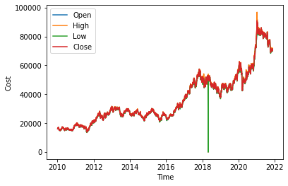
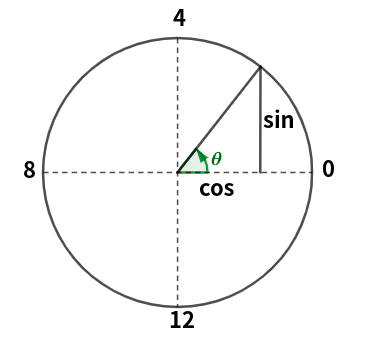
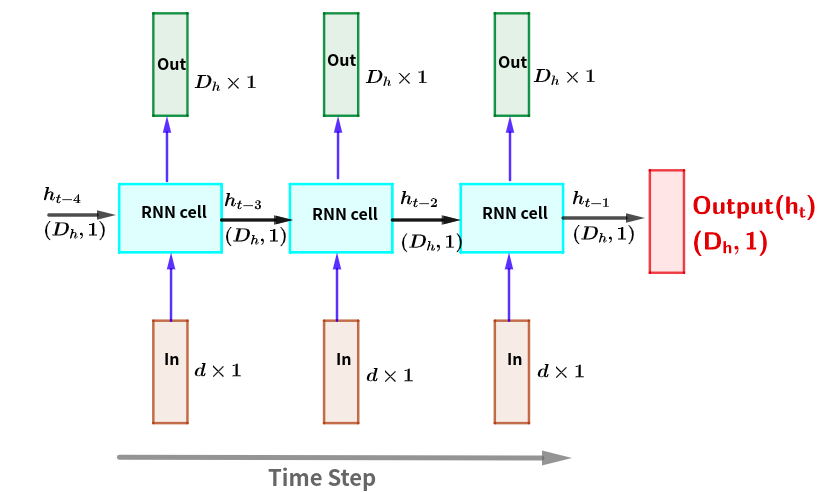
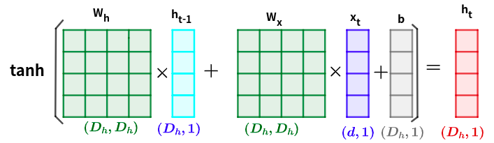

# 시계열 분석
[참조](https://towardsdatascience.com/building-rnn-lstm-and-gru-for-time-series-using-pytorch-a46e5b094e7b)

역사적으로 시계열 예측은 기능 엔지니어링이 지원될 때 다양한 문제에 대해 잘 이해되고 매우 효과적이기 때문에 선형 및 앙상블 방법에 의해 지배되었습니다. 부분적으로 이러한 이유로 딥 러닝은 다소 무시되었습니다. 즉, 이미지 인식, 음성 인식, NLP 등 다른 영역에 비해 시계열 예측에 미치는 영향이 적습니다.

80년대 RNN(Recurrent Neural Networks)의 등장에 이어 1997년 LSTM(Long-Short Term Memory), 2014년 GRU(Gated Recurrent Unit)와 같은 보다 정교한 RNN 구조가 등장하면서 딥 러닝 기술 제한된 기능 엔지니어링으로 순차적 입력과 출력 간의 복잡한 관계를 학습할 수 있습니다. 요컨대, 이러한 RNN 기술 등은 이전에는 실용적이지 않은 방식으로 대규모 시계열을 분석할 수 있는 큰 잠재력을 가지고 있습니다. 

이 게시물에서는 RNN, LSTM 및 GRU와 같은 일부 RNN 구조를 소개하고 시계열 예측을 위한 딥 러닝 모델 구축을 시작합니다. 
- 원-핫 인코딩, 지연 및 순환 시간 특성과 같이 시계열 예측에 널리 적용되는 특성 엔지니어링 기술 중 일부를 제공합니다. 
- Scikit-learn, Pandas 및 PyTorch를 사용

```python
import FinanceDataReader as fdr
import numpy as np
import pandas as pd
import itertools
import matplotlib.pyplot as plt
import torch
import torch.nn as nn
import torch.nn.functional as F
import torch.optim as optim
```


```python
sam=fdr.DataReader('005930', '2010, 1, 1','2021, 11, 19')
sam.head()
```


<div>

<table border="1" class="dataframe">
  <thead>
    <tr style="text-align: right;">
      <th></th>
      <th>Open</th>
      <th>High</th>
      <th>Low</th>
      <th>Close</th>
      <th>Volume</th>
      <th>Change</th>
    </tr>
    <tr>
      <th>Date</th>
      <th></th>
      <th></th>
      <th></th>
      <th></th>
      <th></th>
      <th></th>
    </tr>
  </thead>
  <tbody>
    <tr>
      <th>2010-01-04</th>
      <td>16060</td>
      <td>16180</td>
      <td>16000</td>
      <td>16180</td>
      <td>239271</td>
      <td>0.012516</td>
    </tr>
    <tr>
      <th>2010-01-05</th>
      <td>16520</td>
      <td>16580</td>
      <td>16300</td>
      <td>16440</td>
      <td>559219</td>
      <td>0.016069</td>
    </tr>
    <tr>
      <th>2010-01-06</th>
      <td>16580</td>
      <td>16820</td>
      <td>16520</td>
      <td>16820</td>
      <td>459755</td>
      <td>0.023114</td>
    </tr>
    <tr>
      <th>2010-01-07</th>
      <td>16820</td>
      <td>16820</td>
      <td>16260</td>
      <td>16260</td>
      <td>443237</td>
      <td>-0.033294</td>
    </tr>
    <tr>
      <th>2010-01-08</th>
      <td>16400</td>
      <td>16420</td>
      <td>16120</td>
      <td>16420</td>
      <td>295798</td>
      <td>0.009840</td>
    </tr>
  </tbody>
</table>
</div>


```python
import matplotlib.pyplot as plt
```


```python
idx=["Open","High","Low", "Close"]
for i in idx:
    plt.plot(sam.index, sam[i], label=i)
plt.xlabel("Time")
plt.ylabel("Cost")
plt.legend(loc="best")
plt.show()
```


    

    


위 자료에서 ``Date-Close``에 대한 모델을 작성합니다. 

이 자체로는 feature(특징)이 시간 하나인 단변수입니다. 이 단변수 데이터 셋을 다변수 데이터 셋으로 변형합니다. Time series는 지도학습으로 전환할 수 있습니다. 즉, Close를 예측하기 위해 특징으로 time, Open, High, Low를 사용할 수 있습니다. 그러나 Time series에서 이러한 특징들은 무시합니다.  

특징을 생성하는 일반적인 두 가지 방법은 다음과 같습니다.  
- 지연된 관찰값들을 특징으로 전달
- DateTime 인덱스에서 날짜 시간 특징으로 사용 

두 접근 방식 모두 장단점이 있으며 작업의 목적에 따라 선택됩니다. 

## 특성으로서 지연된 데이터 사용 

시간 단계를 특징으로 사용하는 것부터 시작하겠습니다. 다시 말해, 이전 n개의 관측값 $X_t, X_{t+1}, \cdots$ 및 $X_{t+n-1}$에서 다음 값 $X_{t+n}$을 예측하려고 합니다. 
- 이전 관측값으로 n개의 열을 만듭니다. ``pandsObject.shift()`` 메서드 사용 


```python
df=sam["Close"]
dfN=pd.DataFrame(df)
for n in range(1, 2):
    dfN[f"lag{n}"] = df.shift(n)
dfN 
```


<div>
<table border="1" class="dataframe">
  <thead>
    <tr style="text-align: right;">
      <th></th>
      <th>Close</th>
      <th>lag1</th>
    </tr>
    <tr>
      <th>Date</th>
      <th></th>
      <th></th>
    </tr>
  </thead>
  <tbody>
    <tr>
      <th>2010-01-04</th>
      <td>16180</td>
      <td>NaN</td>
    </tr>
    <tr>
      <th>2010-01-05</th>
      <td>16440</td>
      <td>16180.0</td>
    </tr>
    <tr>
      <th>2010-01-06</th>
      <td>16820</td>
      <td>16440.0</td>
    </tr>
    <tr>
      <th>2010-01-07</th>
      <td>16260</td>
      <td>16820.0</td>
    </tr>
    <tr>
      <th>2010-01-08</th>
      <td>16420</td>
      <td>16260.0</td>
    </tr>
    <tr>
      <th>...</th>
      <td>...</td>
      <td>...</td>
    </tr>
    <tr>
      <th>2021-11-15</th>
      <td>71400</td>
      <td>70600.0</td>
    </tr>
    <tr>
      <th>2021-11-16</th>
      <td>71300</td>
      <td>71400.0</td>
    </tr>
    <tr>
      <th>2021-11-17</th>
      <td>70700</td>
      <td>71300.0</td>
    </tr>
    <tr>
      <th>2021-11-18</th>
      <td>70200</td>
      <td>70700.0</td>
    </tr>
    <tr>
      <th>2021-11-19</th>
      <td>71200</td>
      <td>70200.0</td>
    </tr>
  </tbody>
</table>
<p>2933 rows × 2 columns</p>
</div>


```python
dfN.iloc[1:]
```


<div>
<table border="1" class="dataframe">
  <thead>
    <tr style="text-align: right;">
      <th></th>
      <th>Close</th>
      <th>lag1</th>
    </tr>
    <tr>
      <th>Date</th>
      <th></th>
      <th></th>
    </tr>
  </thead>
  <tbody>
    <tr>
      <th>2010-01-05</th>
      <td>16440</td>
      <td>16180.0</td>
    </tr>
    <tr>
      <th>2010-01-06</th>
      <td>16820</td>
      <td>16440.0</td>
    </tr>
    <tr>
      <th>2010-01-07</th>
      <td>16260</td>
      <td>16820.0</td>
    </tr>
    <tr>
      <th>2010-01-08</th>
      <td>16420</td>
      <td>16260.0</td>
    </tr>
    <tr>
      <th>2010-01-11</th>
      <td>15940</td>
      <td>16420.0</td>
    </tr>
    <tr>
      <th>...</th>
      <td>...</td>
      <td>...</td>
    </tr>
    <tr>
      <th>2021-11-15</th>
      <td>71400</td>
      <td>70600.0</td>
    </tr>
    <tr>
      <th>2021-11-16</th>
      <td>71300</td>
      <td>71400.0</td>
    </tr>
    <tr>
      <th>2021-11-17</th>
      <td>70700</td>
      <td>71300.0</td>
    </tr>
    <tr>
      <th>2021-11-18</th>
      <td>70200</td>
      <td>70700.0</td>
    </tr>
    <tr>
      <th>2021-11-19</th>
      <td>71200</td>
      <td>70200.0</td>
    </tr>
  </tbody>
</table>
<p>2932 rows × 2 columns</p>
</div>


위 과정을 함수로 생성합니다. 


```python
def generateTimesLag(data, nLag):
    df=data
    dfN=pd.DataFrame(df.copy())
    for n in range(1, nLag+1):
        dfN[f'lag{n}']=df.shift(n)
    dfN=dfN[nLag:]
    return(dfN)
```


```python
dfLag=generateTimesLag(sam["Close"], 100)
dfLag.head(5)
```


<div>
<table border="1" class="dataframe">
  <thead>
    <tr style="text-align: right;">
      <th></th>
      <th>Close</th>
      <th>lag1</th>
      <th>lag2</th>
      <th>lag3</th>
      <th>lag4</th>
      <th>lag5</th>
      <th>lag6</th>
      <th>lag7</th>
      <th>lag8</th>
      <th>lag9</th>
      <th>...</th>
      <th>lag91</th>
      <th>lag92</th>
      <th>lag93</th>
      <th>lag94</th>
      <th>lag95</th>
      <th>lag96</th>
      <th>lag97</th>
      <th>lag98</th>
      <th>lag99</th>
      <th>lag100</th>
    </tr>
    <tr>
      <th>Date</th>
      <th></th>
      <th></th>
      <th></th>
      <th></th>
      <th></th>
      <th></th>
      <th></th>
      <th></th>
      <th></th>
      <th></th>
      <th></th>
      <th></th>
      <th></th>
      <th></th>
      <th></th>
      <th></th>
      <th></th>
      <th></th>
      <th></th>
      <th></th>
      <th></th>
    </tr>
  </thead>
  <tbody>
    <tr>
      <th>2010-05-28</th>
      <td>15560</td>
      <td>15440.0</td>
      <td>15000.0</td>
      <td>14820.0</td>
      <td>15160.0</td>
      <td>15120.0</td>
      <td>15460.0</td>
      <td>15840.0</td>
      <td>15680.0</td>
      <td>16200.0</td>
      <td>...</td>
      <td>16840.0</td>
      <td>16540.0</td>
      <td>15940.0</td>
      <td>16180.0</td>
      <td>15940.0</td>
      <td>16420.0</td>
      <td>16260.0</td>
      <td>16820.0</td>
      <td>16440.0</td>
      <td>16180.0</td>
    </tr>
    <tr>
      <th>2010-05-31</th>
      <td>15520</td>
      <td>15560.0</td>
      <td>15440.0</td>
      <td>15000.0</td>
      <td>14820.0</td>
      <td>15160.0</td>
      <td>15120.0</td>
      <td>15460.0</td>
      <td>15840.0</td>
      <td>15680.0</td>
      <td>...</td>
      <td>16860.0</td>
      <td>16840.0</td>
      <td>16540.0</td>
      <td>15940.0</td>
      <td>16180.0</td>
      <td>15940.0</td>
      <td>16420.0</td>
      <td>16260.0</td>
      <td>16820.0</td>
      <td>16440.0</td>
    </tr>
    <tr>
      <th>2010-06-01</th>
      <td>15360</td>
      <td>15520.0</td>
      <td>15560.0</td>
      <td>15440.0</td>
      <td>15000.0</td>
      <td>14820.0</td>
      <td>15160.0</td>
      <td>15120.0</td>
      <td>15460.0</td>
      <td>15840.0</td>
      <td>...</td>
      <td>16460.0</td>
      <td>16860.0</td>
      <td>16840.0</td>
      <td>16540.0</td>
      <td>15940.0</td>
      <td>16180.0</td>
      <td>15940.0</td>
      <td>16420.0</td>
      <td>16260.0</td>
      <td>16820.0</td>
    </tr>
    <tr>
      <th>2010-06-03</th>
      <td>15540</td>
      <td>15360.0</td>
      <td>15520.0</td>
      <td>15560.0</td>
      <td>15440.0</td>
      <td>15000.0</td>
      <td>14820.0</td>
      <td>15160.0</td>
      <td>15120.0</td>
      <td>15460.0</td>
      <td>...</td>
      <td>16680.0</td>
      <td>16460.0</td>
      <td>16860.0</td>
      <td>16840.0</td>
      <td>16540.0</td>
      <td>15940.0</td>
      <td>16180.0</td>
      <td>15940.0</td>
      <td>16420.0</td>
      <td>16260.0</td>
    </tr>
    <tr>
      <th>2010-06-04</th>
      <td>15860</td>
      <td>15540.0</td>
      <td>15360.0</td>
      <td>15520.0</td>
      <td>15560.0</td>
      <td>15440.0</td>
      <td>15000.0</td>
      <td>14820.0</td>
      <td>15160.0</td>
      <td>15120.0</td>
      <td>...</td>
      <td>17000.0</td>
      <td>16680.0</td>
      <td>16460.0</td>
      <td>16860.0</td>
      <td>16840.0</td>
      <td>16540.0</td>
      <td>15940.0</td>
      <td>16180.0</td>
      <td>15940.0</td>
      <td>16420.0</td>
    </tr>
  </tbody>
</table>
<p>5 rows × 101 columns</p>
</div>


위 결과에서 첫 열의 데이터는 원시데이터의 값들이며 이후 열의 각 값은 그 이전의 값입니다. 즉, 첫행의 경우 원시데이터와 비교하여 

|시간|0열|1열|2열|...|99열|100열|
|:---:|:---:|:---:|:---:|:---:|:---:|:---:|
|시작일로부터<br> 100일후 시간|100일후 값|99일후 값|98일후 값|...|1일후 값|시작일 값|

### Generating features from timestamps

일변량 시계열 데이터 세트가 있으면 날짜 및 시간 등을 특성(feature)으로 사용할 수 있습니다. Pandas  DataFrame 객체에서의 시간 인덱스는 DateTime 객체인 Pandas의 DatetimeIndex 유형입니다. 물론 string의 시간(날짜)등 역시 이 자료형으로 전환할 수 있습니다. 그러므로 다음과 같이 인덱스 값에서 년, 월, 일과 같은 새로운 feature을 쉽게 생성할 수 있습니다. 


```python
time=sam.index
time
```


    DatetimeIndex(['2010-01-04', '2010-01-05', '2010-01-06', '2010-01-07',
                   '2010-01-08', '2010-01-11', '2010-01-12', '2010-01-13',
                   '2010-01-14', '2010-01-15',
                   ...
                   '2021-11-08', '2021-11-09', '2021-11-10', '2021-11-11',
                   '2021-11-12', '2021-11-15', '2021-11-16', '2021-11-17',
                   '2021-11-18', '2021-11-19'],
                  dtype='datetime64[ns]', name='Date', length=2933, freq=None)


```python
time1=pd.DataFrame([time.year, time.month, time.day, time.dayofweek]).T
time1.columns=['year', 'month','day', 'week']
time1.index=time
time1
```


<div>
<table border="1" class="dataframe">
  <thead>
    <tr style="text-align: right;">
      <th></th>
      <th>year</th>
      <th>month</th>
      <th>day</th>
      <th>week</th>
    </tr>
    <tr>
      <th>Date</th>
      <th></th>
      <th></th>
      <th></th>
      <th></th>
    </tr>
  </thead>
  <tbody>
    <tr>
      <th>2010-01-04</th>
      <td>2010</td>
      <td>1</td>
      <td>4</td>
      <td>0</td>
    </tr>
    <tr>
      <th>2010-01-05</th>
      <td>2010</td>
      <td>1</td>
      <td>5</td>
      <td>1</td>
    </tr>
    <tr>
      <th>2010-01-06</th>
      <td>2010</td>
      <td>1</td>
      <td>6</td>
      <td>2</td>
    </tr>
    <tr>
      <th>2010-01-07</th>
      <td>2010</td>
      <td>1</td>
      <td>7</td>
      <td>3</td>
    </tr>
    <tr>
      <th>2010-01-08</th>
      <td>2010</td>
      <td>1</td>
      <td>8</td>
      <td>4</td>
    </tr>
    <tr>
      <th>...</th>
      <td>...</td>
      <td>...</td>
      <td>...</td>
      <td>...</td>
    </tr>
    <tr>
      <th>2021-11-15</th>
      <td>2021</td>
      <td>11</td>
      <td>15</td>
      <td>0</td>
    </tr>
    <tr>
      <th>2021-11-16</th>
      <td>2021</td>
      <td>11</td>
      <td>16</td>
      <td>1</td>
    </tr>
    <tr>
      <th>2021-11-17</th>
      <td>2021</td>
      <td>11</td>
      <td>17</td>
      <td>2</td>
    </tr>
    <tr>
      <th>2021-11-18</th>
      <td>2021</td>
      <td>11</td>
      <td>18</td>
      <td>3</td>
    </tr>
    <tr>
      <th>2021-11-19</th>
      <td>2021</td>
      <td>11</td>
      <td>19</td>
      <td>4</td>
    </tr>
  </tbody>
</table>
<p>2933 rows × 4 columns</p>
</div>


어떤 조작 없이 모델에 날짜 및 시간 feature를 전달하여 실제로 작동할 수 있지만 모델이 이러한 feature 간의 상호 의존성을 학습하기가 더 어렵습니다. 다시말하면 12월 다음에 1월이 온다는 것을 사람들은 일반적으로 자연스럽게 받아들이지만 기계학습을 위한 모델의 경우는 특별한 인식체계를 동원할 때만 가능합니다. 그 문제에 대해 더 많은 예를 쉽게 생각해낼 수 있습니다. 따라서 딥 러닝 모델을 구축하는 데 우수한 feature 엔지니어링이 중요하며, 기존 기계 학습 모델에서는 더욱 그렇습니다.

### Generating cyclical time features
다음은 위 자료의 time1에 주기성을 첨가하는 과정입니다. 이 객체의 month, day, week은 일정한 주기를 가집니다. 이를 각 열의 고유값을 나타내는 것으로 확인할 수 있습니다. 


```python
print(f'month의 고유 수: {time1.month.unique()}')
print(f'day의 고유 수: {time1.day.unique()}')
print(f'week의 고유 수: {time1.week.unique()}')
```

    month의 고유 수: [ 1  2  3  4  5  6  7  8  9 10 11 12]
    day의 고유 수: [ 4  5  6  7  8 11 12 13 14 15 18 19 20 21 22 25 26 27 28 29  1  2  3  9
     10 16 17 23 24 30 31]
    week의 고유 수: [0 1 2 3 4]


위 결과 month의 고유값은 1~12로서 이 범위를 주기로 순환한다는 것을 의미합니다. 이러한 주기성은 각 고유값을 단위원에 대응시켜 다음과 같이 나타낼 수 있습니다. 



위 그림의 주기성은 sin(x), cox(x)로 표현할 수 있습니다. 즉, 이 특성들은 다음과 같이 새로운 값들로 변환할 수 있습니다. 


```python
df=time1.copy()
nme=['_sin','_cos']
cycle=[12, 31, 5]
for i, j in enumerate(df.columns[1:]):
    if i != 2:
        df[j+nme[0]]=np.sin(df[j]*(2.*np.pi/cycle[i]))
        df[j+nme[1]]=np.cos(df[j]*(2.*np.pi/cycle[i]))
    else:
        df[j+nme[0]]=np.sin((df[j]-1)*(2.*np.pi/cycle[i]))
        df[j+nme[1]]=np.cos((df[j]-1)*(2.*np.pi/cycle[i]))
df
```


<div>
<table border="1" class="dataframe">
  <thead>
    <tr style="text-align: right;">
      <th></th>
      <th>year</th>
      <th>month</th>
      <th>day</th>
      <th>week</th>
      <th>month_sin</th>
      <th>month_cos</th>
      <th>day_sin</th>
      <th>day_cos</th>
      <th>week_sin</th>
      <th>week_cos</th>
    </tr>
    <tr>
      <th>Date</th>
      <th></th>
      <th></th>
      <th></th>
      <th></th>
      <th></th>
      <th></th>
      <th></th>
      <th></th>
      <th></th>
      <th></th>
    </tr>
  </thead>
  <tbody>
    <tr>
      <th>2010-01-04</th>
      <td>2010</td>
      <td>1</td>
      <td>4</td>
      <td>0</td>
      <td>0.5</td>
      <td>0.866025</td>
      <td>0.724793</td>
      <td>0.688967</td>
      <td>-0.951057</td>
      <td>0.309017</td>
    </tr>
    <tr>
      <th>2010-01-05</th>
      <td>2010</td>
      <td>1</td>
      <td>5</td>
      <td>1</td>
      <td>0.5</td>
      <td>0.866025</td>
      <td>0.848644</td>
      <td>0.528964</td>
      <td>0.000000</td>
      <td>1.000000</td>
    </tr>
    <tr>
      <th>2010-01-06</th>
      <td>2010</td>
      <td>1</td>
      <td>6</td>
      <td>2</td>
      <td>0.5</td>
      <td>0.866025</td>
      <td>0.937752</td>
      <td>0.347305</td>
      <td>0.951057</td>
      <td>0.309017</td>
    </tr>
    <tr>
      <th>2010-01-07</th>
      <td>2010</td>
      <td>1</td>
      <td>7</td>
      <td>3</td>
      <td>0.5</td>
      <td>0.866025</td>
      <td>0.988468</td>
      <td>0.151428</td>
      <td>0.587785</td>
      <td>-0.809017</td>
    </tr>
    <tr>
      <th>2010-01-08</th>
      <td>2010</td>
      <td>1</td>
      <td>8</td>
      <td>4</td>
      <td>0.5</td>
      <td>0.866025</td>
      <td>0.998717</td>
      <td>-0.050649</td>
      <td>-0.587785</td>
      <td>-0.809017</td>
    </tr>
    <tr>
      <th>...</th>
      <td>...</td>
      <td>...</td>
      <td>...</td>
      <td>...</td>
      <td>...</td>
      <td>...</td>
      <td>...</td>
      <td>...</td>
      <td>...</td>
      <td>...</td>
    </tr>
    <tr>
      <th>2021-11-15</th>
      <td>2021</td>
      <td>11</td>
      <td>15</td>
      <td>0</td>
      <td>-0.5</td>
      <td>0.866025</td>
      <td>0.101168</td>
      <td>-0.994869</td>
      <td>-0.951057</td>
      <td>0.309017</td>
    </tr>
    <tr>
      <th>2021-11-16</th>
      <td>2021</td>
      <td>11</td>
      <td>16</td>
      <td>1</td>
      <td>-0.5</td>
      <td>0.866025</td>
      <td>-0.101168</td>
      <td>-0.994869</td>
      <td>0.000000</td>
      <td>1.000000</td>
    </tr>
    <tr>
      <th>2021-11-17</th>
      <td>2021</td>
      <td>11</td>
      <td>17</td>
      <td>2</td>
      <td>-0.5</td>
      <td>0.866025</td>
      <td>-0.299363</td>
      <td>-0.954139</td>
      <td>0.951057</td>
      <td>0.309017</td>
    </tr>
    <tr>
      <th>2021-11-18</th>
      <td>2021</td>
      <td>11</td>
      <td>18</td>
      <td>3</td>
      <td>-0.5</td>
      <td>0.866025</td>
      <td>-0.485302</td>
      <td>-0.874347</td>
      <td>0.587785</td>
      <td>-0.809017</td>
    </tr>
    <tr>
      <th>2021-11-19</th>
      <td>2021</td>
      <td>11</td>
      <td>19</td>
      <td>4</td>
      <td>-0.5</td>
      <td>0.866025</td>
      <td>-0.651372</td>
      <td>-0.758758</td>
      <td>-0.587785</td>
      <td>-0.809017</td>
    </tr>
  </tbody>
</table>
<p>2933 rows × 10 columns</p>
</div>


위 결과와 같이 각 시간변수를 [-1, 1]의 범위내에서 주기적으로 변화하는 값들은 sin과 cos 값인 새로운 변수를 첨가할 수 있습니다. 

### One-hot Encoding
DateTime 기능을 인코딩하는 다른 방법은 범주형 변수로 처리하고 원-핫 인코딩으로 널리 알려진 각 고유 값에 대해 새 이진 변수를 추가하는 것입니다. 1에서 12까지 범위의 월 열에 원-핫 인코딩을 적용했다고 가정합니다. 이 경우 [Jan, Feb, ... Dec]와 같이 12개의 새 월 열이 생성되고 이러한 열 중 하나만 값 1을 갖고 나머지는 0이 되도록 생성합니다. 예를 들어, 2월의 일부 DateTime 값은 [0, 1, … 0]에서와 같이 이러한 인코딩된 열 중 두 번째 열을 1로 가져야 합니다. 

**get_dunmmy 메소드**

Pandas의 get_dummies 메소드를 사용하여 주어진 데이터 세트에서 원-핫 인코딩된 열을 쉽게 생성할 수 있습니다.


```python
mn=pd.get_dummies(time1.month, prefix='month')
pd.concat([sam['Close'], mn], axis=1)
```


<div>
<table border="1" class="dataframe">
  <thead>
    <tr style="text-align: right;">
      <th></th>
      <th>Close</th>
      <th>month_1</th>
      <th>month_2</th>
      <th>month_3</th>
      <th>month_4</th>
      <th>month_5</th>
      <th>month_6</th>
      <th>month_7</th>
      <th>month_8</th>
      <th>month_9</th>
      <th>month_10</th>
      <th>month_11</th>
      <th>month_12</th>
    </tr>
    <tr>
      <th>Date</th>
      <th></th>
      <th></th>
      <th></th>
      <th></th>
      <th></th>
      <th></th>
      <th></th>
      <th></th>
      <th></th>
      <th></th>
      <th></th>
      <th></th>
      <th></th>
    </tr>
  </thead>
  <tbody>
    <tr>
      <th>2010-01-04</th>
      <td>16180</td>
      <td>1</td>
      <td>0</td>
      <td>0</td>
      <td>0</td>
      <td>0</td>
      <td>0</td>
      <td>0</td>
      <td>0</td>
      <td>0</td>
      <td>0</td>
      <td>0</td>
      <td>0</td>
    </tr>
    <tr>
      <th>2010-01-05</th>
      <td>16440</td>
      <td>1</td>
      <td>0</td>
      <td>0</td>
      <td>0</td>
      <td>0</td>
      <td>0</td>
      <td>0</td>
      <td>0</td>
      <td>0</td>
      <td>0</td>
      <td>0</td>
      <td>0</td>
    </tr>
    <tr>
      <th>2010-01-06</th>
      <td>16820</td>
      <td>1</td>
      <td>0</td>
      <td>0</td>
      <td>0</td>
      <td>0</td>
      <td>0</td>
      <td>0</td>
      <td>0</td>
      <td>0</td>
      <td>0</td>
      <td>0</td>
      <td>0</td>
    </tr>
    <tr>
      <th>2010-01-07</th>
      <td>16260</td>
      <td>1</td>
      <td>0</td>
      <td>0</td>
      <td>0</td>
      <td>0</td>
      <td>0</td>
      <td>0</td>
      <td>0</td>
      <td>0</td>
      <td>0</td>
      <td>0</td>
      <td>0</td>
    </tr>
    <tr>
      <th>2010-01-08</th>
      <td>16420</td>
      <td>1</td>
      <td>0</td>
      <td>0</td>
      <td>0</td>
      <td>0</td>
      <td>0</td>
      <td>0</td>
      <td>0</td>
      <td>0</td>
      <td>0</td>
      <td>0</td>
      <td>0</td>
    </tr>
    <tr>
      <th>...</th>
      <td>...</td>
      <td>...</td>
      <td>...</td>
      <td>...</td>
      <td>...</td>
      <td>...</td>
      <td>...</td>
      <td>...</td>
      <td>...</td>
      <td>...</td>
      <td>...</td>
      <td>...</td>
      <td>...</td>
    </tr>
    <tr>
      <th>2021-11-15</th>
      <td>71400</td>
      <td>0</td>
      <td>0</td>
      <td>0</td>
      <td>0</td>
      <td>0</td>
      <td>0</td>
      <td>0</td>
      <td>0</td>
      <td>0</td>
      <td>0</td>
      <td>1</td>
      <td>0</td>
    </tr>
    <tr>
      <th>2021-11-16</th>
      <td>71300</td>
      <td>0</td>
      <td>0</td>
      <td>0</td>
      <td>0</td>
      <td>0</td>
      <td>0</td>
      <td>0</td>
      <td>0</td>
      <td>0</td>
      <td>0</td>
      <td>1</td>
      <td>0</td>
    </tr>
    <tr>
      <th>2021-11-17</th>
      <td>70700</td>
      <td>0</td>
      <td>0</td>
      <td>0</td>
      <td>0</td>
      <td>0</td>
      <td>0</td>
      <td>0</td>
      <td>0</td>
      <td>0</td>
      <td>0</td>
      <td>1</td>
      <td>0</td>
    </tr>
    <tr>
      <th>2021-11-18</th>
      <td>70200</td>
      <td>0</td>
      <td>0</td>
      <td>0</td>
      <td>0</td>
      <td>0</td>
      <td>0</td>
      <td>0</td>
      <td>0</td>
      <td>0</td>
      <td>0</td>
      <td>1</td>
      <td>0</td>
    </tr>
    <tr>
      <th>2021-11-19</th>
      <td>71200</td>
      <td>0</td>
      <td>0</td>
      <td>0</td>
      <td>0</td>
      <td>0</td>
      <td>0</td>
      <td>0</td>
      <td>0</td>
      <td>0</td>
      <td>0</td>
      <td>1</td>
      <td>0</td>
    </tr>
  </tbody>
</table>
<p>2933 rows × 13 columns</p>
</div>


```python
ohCode=pd.DataFrame()
for i in time1.columns[1:]:
    x1=pd.get_dummies(time1[i], prefix=i)
    ohCode=pd.concat([ohCode, x1], axis=1)
ohCode=pd.concat([sam.Close, time1.year, ohCode], axis=1)
ohCode
```


<div>
<table border="1" class="dataframe">
  <thead>
    <tr style="text-align: right;">
      <th></th>
      <th>Close</th>
      <th>year</th>
      <th>month_1</th>
      <th>month_2</th>
      <th>month_3</th>
      <th>month_4</th>
      <th>month_5</th>
      <th>month_6</th>
      <th>month_7</th>
      <th>month_8</th>
      <th>...</th>
      <th>day_27</th>
      <th>day_28</th>
      <th>day_29</th>
      <th>day_30</th>
      <th>day_31</th>
      <th>week_0</th>
      <th>week_1</th>
      <th>week_2</th>
      <th>week_3</th>
      <th>week_4</th>
    </tr>
    <tr>
      <th>Date</th>
      <th></th>
      <th></th>
      <th></th>
      <th></th>
      <th></th>
      <th></th>
      <th></th>
      <th></th>
      <th></th>
      <th></th>
      <th></th>
      <th></th>
      <th></th>
      <th></th>
      <th></th>
      <th></th>
      <th></th>
      <th></th>
      <th></th>
      <th></th>
      <th></th>
    </tr>
  </thead>
  <tbody>
    <tr>
      <th>2010-01-04</th>
      <td>16180</td>
      <td>2010</td>
      <td>1</td>
      <td>0</td>
      <td>0</td>
      <td>0</td>
      <td>0</td>
      <td>0</td>
      <td>0</td>
      <td>0</td>
      <td>...</td>
      <td>0</td>
      <td>0</td>
      <td>0</td>
      <td>0</td>
      <td>0</td>
      <td>1</td>
      <td>0</td>
      <td>0</td>
      <td>0</td>
      <td>0</td>
    </tr>
    <tr>
      <th>2010-01-05</th>
      <td>16440</td>
      <td>2010</td>
      <td>1</td>
      <td>0</td>
      <td>0</td>
      <td>0</td>
      <td>0</td>
      <td>0</td>
      <td>0</td>
      <td>0</td>
      <td>...</td>
      <td>0</td>
      <td>0</td>
      <td>0</td>
      <td>0</td>
      <td>0</td>
      <td>0</td>
      <td>1</td>
      <td>0</td>
      <td>0</td>
      <td>0</td>
    </tr>
    <tr>
      <th>2010-01-06</th>
      <td>16820</td>
      <td>2010</td>
      <td>1</td>
      <td>0</td>
      <td>0</td>
      <td>0</td>
      <td>0</td>
      <td>0</td>
      <td>0</td>
      <td>0</td>
      <td>...</td>
      <td>0</td>
      <td>0</td>
      <td>0</td>
      <td>0</td>
      <td>0</td>
      <td>0</td>
      <td>0</td>
      <td>1</td>
      <td>0</td>
      <td>0</td>
    </tr>
    <tr>
      <th>2010-01-07</th>
      <td>16260</td>
      <td>2010</td>
      <td>1</td>
      <td>0</td>
      <td>0</td>
      <td>0</td>
      <td>0</td>
      <td>0</td>
      <td>0</td>
      <td>0</td>
      <td>...</td>
      <td>0</td>
      <td>0</td>
      <td>0</td>
      <td>0</td>
      <td>0</td>
      <td>0</td>
      <td>0</td>
      <td>0</td>
      <td>1</td>
      <td>0</td>
    </tr>
    <tr>
      <th>2010-01-08</th>
      <td>16420</td>
      <td>2010</td>
      <td>1</td>
      <td>0</td>
      <td>0</td>
      <td>0</td>
      <td>0</td>
      <td>0</td>
      <td>0</td>
      <td>0</td>
      <td>...</td>
      <td>0</td>
      <td>0</td>
      <td>0</td>
      <td>0</td>
      <td>0</td>
      <td>0</td>
      <td>0</td>
      <td>0</td>
      <td>0</td>
      <td>1</td>
    </tr>
    <tr>
      <th>...</th>
      <td>...</td>
      <td>...</td>
      <td>...</td>
      <td>...</td>
      <td>...</td>
      <td>...</td>
      <td>...</td>
      <td>...</td>
      <td>...</td>
      <td>...</td>
      <td>...</td>
      <td>...</td>
      <td>...</td>
      <td>...</td>
      <td>...</td>
      <td>...</td>
      <td>...</td>
      <td>...</td>
      <td>...</td>
      <td>...</td>
      <td>...</td>
    </tr>
    <tr>
      <th>2021-11-15</th>
      <td>71400</td>
      <td>2021</td>
      <td>0</td>
      <td>0</td>
      <td>0</td>
      <td>0</td>
      <td>0</td>
      <td>0</td>
      <td>0</td>
      <td>0</td>
      <td>...</td>
      <td>0</td>
      <td>0</td>
      <td>0</td>
      <td>0</td>
      <td>0</td>
      <td>1</td>
      <td>0</td>
      <td>0</td>
      <td>0</td>
      <td>0</td>
    </tr>
    <tr>
      <th>2021-11-16</th>
      <td>71300</td>
      <td>2021</td>
      <td>0</td>
      <td>0</td>
      <td>0</td>
      <td>0</td>
      <td>0</td>
      <td>0</td>
      <td>0</td>
      <td>0</td>
      <td>...</td>
      <td>0</td>
      <td>0</td>
      <td>0</td>
      <td>0</td>
      <td>0</td>
      <td>0</td>
      <td>1</td>
      <td>0</td>
      <td>0</td>
      <td>0</td>
    </tr>
    <tr>
      <th>2021-11-17</th>
      <td>70700</td>
      <td>2021</td>
      <td>0</td>
      <td>0</td>
      <td>0</td>
      <td>0</td>
      <td>0</td>
      <td>0</td>
      <td>0</td>
      <td>0</td>
      <td>...</td>
      <td>0</td>
      <td>0</td>
      <td>0</td>
      <td>0</td>
      <td>0</td>
      <td>0</td>
      <td>0</td>
      <td>1</td>
      <td>0</td>
      <td>0</td>
    </tr>
    <tr>
      <th>2021-11-18</th>
      <td>70200</td>
      <td>2021</td>
      <td>0</td>
      <td>0</td>
      <td>0</td>
      <td>0</td>
      <td>0</td>
      <td>0</td>
      <td>0</td>
      <td>0</td>
      <td>...</td>
      <td>0</td>
      <td>0</td>
      <td>0</td>
      <td>0</td>
      <td>0</td>
      <td>0</td>
      <td>0</td>
      <td>0</td>
      <td>1</td>
      <td>0</td>
    </tr>
    <tr>
      <th>2021-11-19</th>
      <td>71200</td>
      <td>2021</td>
      <td>0</td>
      <td>0</td>
      <td>0</td>
      <td>0</td>
      <td>0</td>
      <td>0</td>
      <td>0</td>
      <td>0</td>
      <td>...</td>
      <td>0</td>
      <td>0</td>
      <td>0</td>
      <td>0</td>
      <td>0</td>
      <td>0</td>
      <td>0</td>
      <td>0</td>
      <td>0</td>
      <td>1</td>
    </tr>
  </tbody>
</table>
<p>2933 rows × 50 columns</p>
</div>


**sklearn.preprocessing.OneHotEncoder 클래스 사용**

Scikit-learn의 OneHotEncoder를 사용하여 원-핫인코딩을 실시할 수 있습니다. 

```
sklearn.preprocessing.OneHotEncoder()
```
위 클래스는 대상 1개 이상의 열에 대해 각 열의 one-hot encoding을 동시에 진행 할 수 있습니다. 


```python
from sklearn.preprocessing import OneHotEncoder
```


```python
time1.head(3)
```


<div>
<table border="1" class="dataframe">
  <thead>
    <tr style="text-align: right;">
      <th></th>
      <th>year</th>
      <th>month</th>
      <th>day</th>
      <th>week</th>
    </tr>
    <tr>
      <th>Date</th>
      <th></th>
      <th></th>
      <th></th>
      <th></th>
    </tr>
  </thead>
  <tbody>
    <tr>
      <th>2010-01-04</th>
      <td>2010</td>
      <td>1</td>
      <td>4</td>
      <td>0</td>
    </tr>
    <tr>
      <th>2010-01-05</th>
      <td>2010</td>
      <td>1</td>
      <td>5</td>
      <td>1</td>
    </tr>
    <tr>
      <th>2010-01-06</th>
      <td>2010</td>
      <td>1</td>
      <td>6</td>
      <td>2</td>
    </tr>
  </tbody>
</table>
</div>


```python
skOh=OneHotEncoder().fit(time1.iloc[:,1:])
skOh
```


    OneHotEncoder()


```python
skOh.categories_
```


    [array([ 1,  2,  3,  4,  5,  6,  7,  8,  9, 10, 11, 12]),
     array([ 1,  2,  3,  4,  5,  6,  7,  8,  9, 10, 11, 12, 13, 14, 15, 16, 17,
            18, 19, 20, 21, 22, 23, 24, 25, 26, 27, 28, 29, 30, 31]),
     array([0, 1, 2, 3, 4])]


```python
re=skOh.transform(time1.iloc[:,1:]).toarray()
re
```


    array([[1., 0., 0., ..., 0., 0., 0.],
           [1., 0., 0., ..., 0., 0., 0.],
           [1., 0., 0., ..., 1., 0., 0.],
           ...,
           [0., 0., 0., ..., 1., 0., 0.],
           [0., 0., 0., ..., 0., 1., 0.],
           [0., 0., 0., ..., 0., 0., 1.]])


이 변환은 12개월 주기인 월, 31일 주기인 일, 그리고 주식 거래일인 월, 화, 수, 목, 금(0, 1, 2, 3 ,4)인 5 주기에 대한 변환이므로 48개 열이 생성됩니다. 


```python
re.shape
```


    (2933, 48)


변환된 데이터의 원형은 ``inverse_transform()`` 메소드에 의해 확인 할 수 있습니다. 


```python
skOh.inverse_transform(re)
```


    array([[ 1,  4,  0],
           [ 1,  5,  1],
           [ 1,  6,  2],
           ...,
           [11, 17,  2],
           [11, 18,  3],
           [11, 19,  4]])


**torch.torch.functional.one_hot() 함수 사용**

``torch.functional.one_hot(tensor, num_classes=-1)``함수에 의해 원-핫 인코딩을 실시할 수 있습니다. 
- num_classes는 원-핫 인코딩을 위한 클래스 수(컬럼수)를 의미
- 이 함수 내부적으로 생성되는 클래스 수는 0~tensor 객체의 최대값입니다. 
- month의 경우 객체의 최대값은 12이므로 실제적으로 생성되는 클래스 수는 [0, 12]로 13개 입니다. 
- num_classes의 기본값은 -1이고 이 경우는 위 과정이 자동으로 계산됩니다. 
- 수동으로 지정하기 위해서는 위의 자동지정된 값보다 커야 합니다. 즉, month의 경우 13이상이어야 합니다.
- 여러개의 변수(열)을 동시에 변환할 경우 그 객체의 최대값을 기분으로 하므로 각 열의 클래스수는 동일해집니다. 
- month의 경우 12개의 클래스가 맞지만 한개의 클래스가 더 생성됩니다. 그러나 여분이 되는 이 클래스의 값은 모두 0이므로 계산 결과에 영향에 없습니다.
- 그러나 메모리 관리 측면에서 불리합니다. 
- 텐서의 행 단위로 변환합니다. 예를들어 
   차원(10,)벡터, 클래스 수 3 : 차원(10, 3)
   차원(10,2) 행렬, 클래스 수2: 차원(10, 2, 6) 
1차원 tensor는 2차원으로 반환됩니다. 이러한 변환은 하나의 열은 1개의 행렬로 반환됩니다. 그러므로 여러개의 열을 동시에 변환할 경우 여러개의 2차원 행렬이 생성되므로 결과물은 3차원이 됩니다.   


```python
mnOH=F.one_hot(torch.from_numpy(time1.values[:,1])) # 1차원 벡터의 변환
mnOH #2차원으로 반환 
```


    tensor([[0, 1, 0,  ..., 0, 0, 0],
            [0, 1, 0,  ..., 0, 0, 0],
            [0, 1, 0,  ..., 0, 0, 0],
            ...,
            [0, 0, 0,  ..., 0, 1, 0],
            [0, 0, 0,  ..., 0, 1, 0],
            [0, 0, 0,  ..., 0, 1, 0]])


```python
mnOH.shape
```


    torch.Size([2933, 13])


```python
dateOh=F.one_hot(torch.from_numpy(time1.values[:,1:]))
dateOh.shape
```


    torch.Size([2933, 3, 32])


### 데이터 셋의 분할 
데이터 세트를 학습, 검증 및 테스트 세트의 세 가지 데이터 세트로 분할합니다. 시간 의존적 데이터를 다루기 때문에 시간 순서를 그대로 유지하고 원하는 경우 섞이지 않게 유지하는 것이 중요합니다. 매개변수 shuffle을 false로 설정하여 세트로 분할하는 동안 셔플을 방지하여 쉽게 수행할 수 있습니다.

``sklearn.model_selection.train_test_split(*arrays, test_size=None, train_size=None, random_state=None, shuffle=True, stratify=None)``를 사용할 수 있습니다. 

``Close`` 데이터의 shift() 메소드를 적용하여 시계열 데이터를 사용합니다. 


```python
from sklearn.model_selection import train_test_split
```


```python
data=generateTimesLag(sam["Close"], 10)
data.head(5)
```


<div>
<style scoped>
    .dataframe tbody tr th:only-of-type {
        vertical-align: middle;
    }

    .dataframe tbody tr th {
        vertical-align: top;
    }

    .dataframe thead th {
        text-align: right;
    }
</style>
<table border="1" class="dataframe">
  <thead>
    <tr style="text-align: right;">
      <th></th>
      <th>Close</th>
      <th>lag1</th>
      <th>lag2</th>
      <th>lag3</th>
      <th>lag4</th>
      <th>lag5</th>
      <th>lag6</th>
      <th>lag7</th>
      <th>lag8</th>
      <th>lag9</th>
      <th>lag10</th>
    </tr>
    <tr>
      <th>Date</th>
      <th></th>
      <th></th>
      <th></th>
      <th></th>
      <th></th>
      <th></th>
      <th></th>
      <th></th>
      <th></th>
      <th></th>
      <th></th>
    </tr>
  </thead>
  <tbody>
    <tr>
      <th>2010-01-18</th>
      <td>16860</td>
      <td>16840.0</td>
      <td>16540.0</td>
      <td>15940.0</td>
      <td>16180.0</td>
      <td>15940.0</td>
      <td>16420.0</td>
      <td>16260.0</td>
      <td>16820.0</td>
      <td>16440.0</td>
      <td>16180.0</td>
    </tr>
    <tr>
      <th>2010-01-19</th>
      <td>16460</td>
      <td>16860.0</td>
      <td>16840.0</td>
      <td>16540.0</td>
      <td>15940.0</td>
      <td>16180.0</td>
      <td>15940.0</td>
      <td>16420.0</td>
      <td>16260.0</td>
      <td>16820.0</td>
      <td>16440.0</td>
    </tr>
    <tr>
      <th>2010-01-20</th>
      <td>16680</td>
      <td>16460.0</td>
      <td>16860.0</td>
      <td>16840.0</td>
      <td>16540.0</td>
      <td>15940.0</td>
      <td>16180.0</td>
      <td>15940.0</td>
      <td>16420.0</td>
      <td>16260.0</td>
      <td>16820.0</td>
    </tr>
    <tr>
      <th>2010-01-21</th>
      <td>17000</td>
      <td>16680.0</td>
      <td>16460.0</td>
      <td>16860.0</td>
      <td>16840.0</td>
      <td>16540.0</td>
      <td>15940.0</td>
      <td>16180.0</td>
      <td>15940.0</td>
      <td>16420.0</td>
      <td>16260.0</td>
    </tr>
    <tr>
      <th>2010-01-22</th>
      <td>16500</td>
      <td>17000.0</td>
      <td>16680.0</td>
      <td>16460.0</td>
      <td>16860.0</td>
      <td>16840.0</td>
      <td>16540.0</td>
      <td>15940.0</td>
      <td>16180.0</td>
      <td>15940.0</td>
      <td>16420.0</td>
    </tr>
  </tbody>
</table>
</div>


위 객체에서 `Close`는 label, 나머지 shift된 데이터들은 feature가 됩니다. 
각 feature와 label의 scale을 축소시키기 위해 표준화 시킵니다. [sklearn.preprocessing](https://scikit-learn.org/stable/modules/preprocessing.html#standardization-or-mean-removal-and-variance-scaling)모듈에서 여러 형식의 표준화 클래스를 제공합니다. 여기서는 ``MinMaxScaler()`` 클래스를 적용합니다. 
일반적으로 label은 표준화에 자유롭지만 표준화를 적용하기 위해서는 feature와 별도로 진행합니다. 또한 전달하는 인수는 벡터가 아닌 행렬 즉, 2차원이어야 합니다. 


```python
from sklearn.preprocessing import MinMaxScaler
```


```python
X=data.values[:,1:]
y=data.values[:, 0]
scalerF=MinMaxScaler().fit(X)
scalerF.data_max_
```


    array([91000., 91000., 91000., 91000., 91000., 91000., 91000., 91000.,
           91000., 91000.])


```python
Xn=scalerF.transform(X)
Xn[:3,:]
```


    array([[0.04186047, 0.0379845 , 0.03023256, 0.03333333, 0.03023256,
            0.03643411, 0.03436693, 0.04160207, 0.03669251, 0.03333333],
           [0.04211886, 0.04186047, 0.0379845 , 0.03023256, 0.03333333,
            0.03023256, 0.03643411, 0.03436693, 0.04160207, 0.03669251],
           [0.0369509 , 0.04211886, 0.04186047, 0.0379845 , 0.03023256,
            0.03333333, 0.03023256, 0.03643411, 0.03436693, 0.04160207]])


```python
scalerL=MinMaxScaler().fit(y.reshape(-1,1))
yn=scalerL.transform(y.reshape(-1,1))
yn[:3]
```


    array([[0.04211886],
           [0.0369509 ],
           [0.03979328]])


최종적으로 train, validation, test 데이터셋으로 분리합니다. 


```python
xTr, xTe, yTr, yTe=train_test_split(Xn, yn, test_size=0.2, random_state=1, shuffle=False)
xTr, xVal, yTr, yVal=train_test_split(xTr, yTr, test_size=0.2, random_state=1, shuffle=False)
```


```python
xTr.shape, xVal.shape, xTe.shape
```


    ((1870, 10), (468, 10), (585, 10))


데이터의 크기가 큰 경우 미니배치로 학습을 합니다. 이 경우 PyTorch의 DataLoader 클래스를 사용합니다. 이 클래스의 인자는 [Dataset 형](https://pytorch.org/tutorials/beginner/data_loading_tutorial.html)입니다. 데이터 세트에는 주로 두 가지 유형이 있습니다. 하나는 맵 스타일 데이터 세트이고 다른 하나는 반복 가능한 스타일 데이터 세트입니다. pytorch의 경우 반복가능한 데이터 셋을 사용해야 합니다. 

데이터세트 클래스인 ``TensorDataset``이라는 클래스를 사용하겠습니다. Scikit-learn의 scaler는 NumPy 배열을 출력하므로 TensorDatasets에 로드하려면 이를 Torch 텐서로 변환해야 합니다. 각 데이터 세트에 대한 Tensor 데이터 세트를 생성한 후 이를 사용하여 DataLoader를 생성하겠습니다.


```python
obj=[xTr, xVal, xTe, yTr, yVal, yTe]
xTr1, xVal1, xTe1, yTr1, yVal1, yTe1=map(torch.Tensor, obj)
xTr1
```


    tensor([[0.0419, 0.0380, 0.0302,  ..., 0.0416, 0.0367, 0.0333],
            [0.0421, 0.0419, 0.0380,  ..., 0.0344, 0.0416, 0.0367],
            [0.0370, 0.0421, 0.0419,  ..., 0.0364, 0.0344, 0.0416],
            ...,
            [0.4522, 0.4470, 0.4413,  ..., 0.4842, 0.4858, 0.4798],
            [0.4574, 0.4522, 0.4470,  ..., 0.4814, 0.4842, 0.4858],
            [0.4416, 0.4574, 0.4522,  ..., 0.4703, 0.4814, 0.4842]])


```python
from torch.utils.data import TensorDataset, DataLoader
```


```python
train=TensorDataset(xTr1, yTr1)
val=TensorDataset(xVal1, yVal1)
test=TensorDataset(xTe1, yTe1)
```


```python
batSize=64
trainLoader=DataLoader(train, batch_size=batSize, shuffle=False)
valLoader=DataLoader(val, batch_size=batSize, shuffle=False)
testLoader=DataLoader(test, batch_size=batSize, shuffle=False)
testLoaderOne=DataLoader(test, batch_size=1, shuffle=False)
```

테스트셋은 학습으로 구축된 모델의 과적합등을 점검하기 위해 사용됩니다. 이 단계에서 미니배치를 사용할 수 있지만 배치없이 모든 데이터를 한번에 사용할 수 있습니다. 물론 배치없이 적용하는 것이 빠른 연산을 할 수 있습니다.

## Recurrent Neural Networks (RNN)
다음을 참조합니다.
Andrej Karpathy’s [The Unreasonable Effectiveness of Recurrent Neural Networks](http://karpathy.github.io/2015/05/21/rnn-effectiveness/), Chris Olah’s [Understanding LSTM networks](https://colah.github.io/posts/2015-08-Understanding-LSTMs/) and Michael Phi’s [Illustrated Guide to LSTM’s and GRU’s: A step by step explanation](https://towardsdatascience.com/illustrated-guide-to-lstms-and-gru-s-a-step-by-step-explanation-44e9eb85bf21)

pytorch의 RNN/LSTM/GRU 메서드는 동일한 파라메터를 가집니다. LSTM을 기준으로 알아보면 다음과 같습니다. 
```(python)
import torch.nn as nn
lstm=nn.RNN(input_size, hidden_size, num_layers, nonlinearlity=tanh, bias=True, batch_first=True, dropout, biddirection)
```
- input_size: input x의 feature의 수(feature)
- hidden_size: 은닉상태 h에서 feature의 수로 다음 층에 입력되는 feature의 수를 의미 
- num_layers: 반복 레이어의 수로서 시간단계 등의 시퀀스 단계를 의미합니다. 예를 들어 num_layers=2로 설정하면 두 번째 RNN이 첫 번째 RNN의 출력을 가져와 최종 결과를 계산하는 두 번째 RNN을 형성하기 위해 두 개의 RNN을 함께 쌓는 것을 의미합니다. 기본값: 1. (seq)
- nonlinearlity: `tanh` 또는 `relu`등의 비선형을 사용, 기본은 `tanh`
- bias: 편차 적용 기본은 True
- batch_first: True이면 input과 output tensors의 차원은 (batch, seq, feature), False이면 (seq, batch, feature). 이 인수는 hidden or cell 상태에 적용되지 않습니다. 기본: False
- dropout: 0이 아니라면 last layer를 제외하고 각 층에서 드롭아웃을 실행합니다. 기본은 0
- biddirection: True이면 양방향 RNN이 됩니다. 기본값: False

input, h_0, output, h_n의 detail
- input: tensor 모양 
    - batch_first=False: (L, N, H<sub>in</sub>)
    - batch_first=True: (N, L, H<sub>in</sub>) 
- h<sub>0</sub>: 배치의 각 요소에 대한 초기 은닉 상태를 포함합니다. tensor의 모양은 
    - (D &times; num\_layers, N, H<sub>out</sub>)
    - 제공되지 않으면 기본값은 0입니다.
- output: tensor 모양 
    -batch_first=False: (L, N, D &times; H<sub>out</sub>)
    -batch_first=True: 각 t에 대해 RNN의 마지막 계층에서 출력 기능(h<sub>t</sub>)을 포함합니다. (N, L, D &times; H<sub>out</sub>)
- h<sub>n</sub>: 배치의 각 요소에 마지막 은닉상태를 포함하며 tensor 모양 (D &times; num\_layers, N, H<sub>out</sub>)
<br><br>
     - N=batch size, 
     - L= sequence length 
     - D= bidrectional=true &rarr; 2, False &rarr; 1
     - H<sub>in</sub> = input size
     - H<sub>out</sub> = hidden size

이 메소드의 변수
- RNN.weight_ih_l[k] – k번째 레이어의 학습 가능한 입력-은닉 가중치
    - k = 0: (hidden_size, input_size)
    - k &ne; 0: (hidden_size, num_directions &times; hidden_size)
- RNN.weight_hh_l[k] – k번째 레이어의 학습 가능한 은닉-은닉 가중치, (hidden_size, hidden_size)
- RNN.bias_ih_l[k] – k번째 레이어의 학습 가능한 입력-은닉 편차, (hidden_size)
- RNN.bias_hh_l[k] – k번째 레이어의 학습 가능한 은닉-은닉 편차, (hidden_size)

각 연산을 차원을 위주로 나타내면 다음과 같습니다. 



입력의 feature 수가 d개이고 은닉층이 D<sub>h</sub>이면 입력에 대한 가중치는 D<sub>h</sub> &times; d가 되며 은닉층의 가중치는 D<sub>h</sub> &times; D<sub>h</sub>가 됩니다. 그러므로 은닉층의 계산에 따른 차원은 다음과 같습니다. 


<br><br>
<center><b>h<sub>t</sub> =tanh(W<sub>x</sub>X<sub>t</sub> + W<sub>h</sub>h<sub>t-1</sub>+b)</b></center>
<br><br>
rnn 층을 통과한 결과는 최종 결과는 다음과 같이 계산됩니다. 
<br><br>
<center><b> y<sub>t</sub>=f(W<sub>y</sub>h<sub>t</sub> +b)</b></center>

## Vanillar RNN

모든 신경망 모듈의 기본 클래스인 PyTorch의 nn.Module을 확장하여 다음과 같이 RNN 모듈을 정의합니다. 우리의 RNN 모듈은 RNN 출력을 원하는 출력 형태로 변환하기 위해 완전히 연결된 레이어(fully connected layer)로 연결된 하나 이상의 RNN 레이어를 가질 것입니다. 또한 forward()라고 하는 클래스 메서드로 순전파 함수를 정의해야 합니다. 이 메서드는 입력과 random으로 초기화된 은닉 상태를 전달하면서 순차적으로 실행됩니다. 그럼에도 불구하고 PyTorch는 역전파(backpropagation) 함수 backward()를 자동으로 생성하고 계산합니다.


```python
class rnnModel(nn.Module):
    def __init__(self, inDim, hiddenDim, layerDim, outDim, dropoutProb):
        super(rnnModel, self).__init__
        # 층들의 수와 각 층의 노드의 수를 정의 
        self.hiddenDim=hiddenDim
        self.layerDim=layerDim
        #rnn layers
        #inDim=batch size, layerDim=시간단계의 수, hiddenDim=feature의 수 
        self.rnn=nn.RNN(inDim, hiddenDim, layerDim, batch_first=True, dropout=dropoutProb)
        #fully connected layer
        self.fc=nn.Linear(hiddenDim, outDim)
        
    def forward(self, x):
        # first input을 위한 은닉상태를 무작위로 초기화 
        h0=torch.rand(self.layerDim, x.size(dim=0), self.hiddenDim).require_grad_()
        
        #모델의 input과 은닉 상태를 통과하는 순전파
        out, h0=self.rnn(x, h0.detach()) #.detach()는 gradient없는 결과만을 추출 
        #out의 차원을 (batchSize, seqLength, hiddenSize)로 변환 
        #이 변환된 out은 fully connected layer에 적합됩니다. 
        out=out[:,-1,:] #out으로부터 1축내 각 2축의 마지막 행에 대응하는 3축의 모든 값들을 추출, 그러므로 2차원 객체로 변환 
        #최종 결과의 모양(batchSize, outDim)으로 변환 
        out=self.fc(out)
        return out        
```

다음은 nn.RNN()의 예 입니다. 


```python
rnn1 = nn.RNN(10, 20, 2)
in1 = torch.randn(5, 3, 10)
h01 = torch.randn(2, 3, 20)
out1, hn1 = rnn1(in1, h01)
out1.shape
```


    torch.Size([5, 3, 20])


```python
hn1.shape
```


    torch.Size([2, 3, 20])


Vanilla RNN(단순 RNN)에는 한 가지 단점이 있습니다. 단순 RNN은 관련 과거 정보와 현재 정보 사이의 시간적 간격이 작은 이전 정보를 현재 정보와 연결할 수 있습니다. 그 격차가 커짐에 따라 RNN은 장기 종속성을 학습하는 능력이 떨어집니다. LSTM이 도움을 요청하는 곳입니다.

## Long Short-Term Memory(LSTM, 장단기 기억)

LSTM은 장기 종속성을 학습할 수 있는 특수한 유형의 순환 네트워크이며 다양한 작업에서 표준 버전보다 훨씬 더 잘 작동하는 경향이 있습니다. 표준 버전과 주요 차이점은 숨겨진 상태 외에도 LSTM에는 이전 단계에서 이후 단계로 관련 정보를 전달하는 컨베이어 벨트처럼 작동하는 셀 상태가 있다는 것입니다. 그 과정에서 어떤 정보가 관련이 있는지 결정하는 두 개의 신경망인 입력 및 망각 게이트를 통해 새로운 정보가 셀 상태에 추가되거나 제거됩니다. 구현의 관점에서 보면 그런 세부 사항에 신경 쓸 필요가 없습니다. 추가해야 할 것은 forward() 메서드의 셀 상태뿐입니다.


```python
class lstmModel(nn.Module):
    def __init__(self, inDim, hiddenDim, layerDim, outDim, dropProb):
        super(lstmModel, self).__init__()
        # 층들의 수와 각 층의 노드의 수를 정의 
        self.hiddenDim=hiddenDim
        self.layerDim=layerDim
        #latm layers
        self.lstm=nn.LSTM(inDim, hiddenDim, layerDim, batch_first=True, dropout=dropoutProb)
        #fully connected layer
        self.fc=nn.Linear(hiddenDim, outDim)
        
    def forward(self, x):
        # first input을 위한 은닉상태를 무작위로 초기화 
        h0=torch.rand(self.layerDim, x.size(dim=0), self.hiddenDim).require_grad_()
        # first input을 위한 cell state를 무작위로 초기화 
        c0=torch.rand(self.layerDim, x.size(dim=0), self.hiddenDim).require_grad_()
        #은닉, cell의 결과를 모델에 첨가하기 위해 기울기 계산과정과 분리된 수치만을 전달해야 합니다. 
        out, (hn,cn)=self.lstm(x, (h0.detach()), (c0.detach()))
        # fully connected layer에 적용하기 위해 
        # 결과를 (batchSize, sequence_length, hiddenSize) 차원으로 변환 
        out = out[:,-1,:]
        # 위의 마지막 결과를 적절한 차원 (batchSize, outDim)으로 변환
        out=self.fc(out)
        return out
```

## Gated Recurrent Unit(GRU)
GRU(Gated Recurrent Units)는 비슷한 성능과 훨씬 더 빠른 계산을 제공하는 약간 더 간소화된 변형입니다. LSTM과 마찬가지로 장기 종속성을 캡처하지만 셀 상태 없이 재설정 및 업데이트 게이트를 사용하여 캡처합니다. 업데이트 게이트가 얼마나 많은 과거 정보를 유지해야 하는지를 결정하는 반면, 리셋 게이트는 얼마나 많은 과거 정보를 잊어야 하는지를 결정합니다. 더 적은 수의 텐서 작업을 수행하는 GRU는 종종 LSTM보다 더 빠르고 더 적은 메모리를 필요로 합니다. 아래에서 볼 수 있듯이 모델 클래스는 RNN과 거의 동일합니다.


```python
class gruModel(nn.Module):
    def __init__(self, inDim, hiddenDim, layerDim, outDim, dropProb):
        super(gruModel, self).__init__()
        # 층들의 수와 각 층의 노드의 수를 정의 
        self.hiddenDim=hiddenDim
        self.layerDim=layerDim
        #latm layers
        self.gru=nn.GRU(inDim, hiddenDim, layerDim, batch_first=True, dropout=dropoutProb)
        #fully connected layer
        self.fc=nn.Linear(hiddenDim, outDim)
        
    def forward(self, x):
        # first input을 위한 은닉상태를 무작위로 초기화 
        h0=torch.rand(self.layerDim, x.size(dim=0), self.hiddenDim).require_grad_()
        # 모델에 input과 은닉층을 전달하는 순전파
        #은닉의 결과를 모델에 첨가하기 위해 기울기 계산과정과 분리된 수치만을 전달해야 합니다. 
        out, _=self.gru(x, h0.detach())
        # fully connected layer에 적용하기 위해 
        # 결과를 (batchSize, sequence_length, hiddenSize) 차원으로 변환 
        out = out[:,-1,:]
        # 위의 마지막 결과를 적절한 차원 (batchSize, outDim)으로 변환
        out=self.fc(out)
        return out
```

위와 같이 각 클래스를 작성하는 것과 다르게 각 모델을 직접 지정할 수 있습니다. 다음은 3가지 모델 선택을 위한 함수입니다. 


```python
def get_model(model, model_params):
    models={
        "rnn":RNNModel,
        "lstm":LSTMModel,
        "gru":GRUModel,
    }
    return models.get(model.lower())(**model_params)
```

## 모델 훈련 

다음 코드는 모델을 학습하는 기본 프레임워크입니다. 이를 수행하는 방법에는 여러 가지가 있을 수 있으며 그 중 하나는 학습, 유효성 검사 및 평가 방법을 보유하는 도우미 또는 래퍼 클래스를 사용하는 것입니다. 
- 모델 클래스
- 손실을 계산하기 위한 손실 함수
- 네트워크의 가중치를 업데이트하기 위한 옵티마이저가 필요합니다. 
신경망에 익숙하다면 신경망을 훈련시키는 것이 forward-prop과 back-prop 사이를 왔다갔다 하는 다소 반복적인 과정이라는 것을 이미 알고 있을 것입니다. 나는 이러한 반복적인 단계를 결합하기 위해 한 수준의 추상화, train 단계 함수 또는 래퍼를 갖는 것이 유용하다는 것을 알게 되었습니다.


```python
class optimS:
    def __init__(self, model, lossFn, optimizer):
        self.model=model
        self.lossFn=lossFn
        self.optimizer=optimizer
        self.trainLoss=[]
        self.valLoss=[]
        
    def trainStep(self, x, y):
        #모델을 학습 모드로 설정, 평가모드는 model.eval()로 설정  
        self.model.train()
        #예측
        yhat=self.model(x)
        #loss
        loss=self.lossFn(y, yhat)
        #gradient 
        loss.backward()
        #updates parameters and zero gradient
        self.optimizer.step()
        self.optimizer.zero_grad()
        #returns the loss
        return loss.item()
    def train(self, train_loader, val_loader, batch_size=64, n_epochs=50, n_features=1):
        model_path = f'models/{self.model}_{datetime.now().strftime("%Y-%m-%d %H:%M:%S")}'

        for epoch in range(1, n_epochs + 1):
            batch_losses = []
            for x_batch, y_batch in train_loader:
                x_batch = x_batch.view([batch_size, -1, n_features]).to(device)
                y_batch = y_batch.to(device)
                loss = self.train_step(x_batch, y_batch)
                batch_losses.append(loss)
            training_loss = np.mean(batch_losses)
            self.train_losses.append(training_loss)

            with torch.no_grad():
                batch_val_losses = []
                for x_val, y_val in val_loader:
                    x_val = x_val.view([batch_size, -1, n_features]).to(device)
                    y_val = y_val.to(device)
                    self.model.eval()
                    yhat = self.model(x_val)
                    val_loss = self.loss_fn(y_val, yhat).item()
                    batch_val_losses.append(val_loss)
                validation_loss = np.mean(batch_val_losses)
                self.val_losses.append(validation_loss)

            if (epoch <= 10) | (epoch % 50 == 0):
                print(
                    f"[{epoch}/{n_epochs}] Training loss: {training_loss:.4f}\t Validation loss: {validation_loss:.4f}"
                )

        torch.save(self.model.state_dict(), model_path)
```

하나의 적절한 훈련 단계를 정의한 후 이제 각 에포크에서 이 단계 함수가 호출되는 훈련 루프 작성으로 이동할 수 있습니다. 훈련의 각 에포크에는 훈련과 검증의 두 단계가 있습니다. 각 훈련 단계 후에 네트워크의 가중치는 손실 함수를 최소화하기 위해 약간 조정됩니다. 그런 다음 유효성 검사 단계에서 모델의 현재 상태를 평가하여 가장 최근 업데이트 후 개선 사항이 있는지 확인합니다. 
각 epoch에서 데이터의 일부만 사용하는 훈련 기술인 미니 배치 훈련을 사용할 것입니다. 배치 크기가 충분히 크면 모델은 데이터 샘플만 학습하여 가중치를 더 효율적으로 학습하고 업데이트할 수 있습니다. 이것은 일반적으로 네트워크에서 입력으로 사용할 수 있도록 각 배치 텐서를 올바른 입력 차원으로 재구성해야 합니다. 텐서 연산의 계산상의 이점을 얻기 위해 3D 입력 텐서를 사용하여 더 일찍 작동하도록 RNN 모델을 정의했습니다. 따라서 각 배치를 창고의 상자와 같이 배치 크기, 시퀀스 길이 및 input_dim 차원을 가진 데이터 패키지로 생각할 수 있습니다. 또한 모델이 배치별로 훈련되고 검증되는 각 단계에 대해 2개의 for 루프가 있습니다. 훈련 중에는 train() 모드를 활성화하고 검증 중에는 eval() 모드를 활성화하는 것이 중요합니다. train() 모드를 사용하면 네트워크의 가중치를 업데이트할 수 있지만 eval() 모드는 기울기를 계산할 필요가 없음을 모델에 알립니다. 따라서 가중치는 작업에 따라 업데이트되거나 동일하게 유지됩니다.
